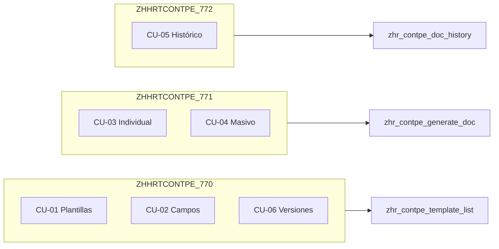

# Transacciones Z — Generador PDF HCM
## SAP S/4HANA

**Versión**: 1.2  
**Fecha**: 11 de Junio de 2026

> **Sigla proyecto CONTPE** — Ver [nomenclature-contpe.md](nomenclature-contpe.md) y [sap-abap-estandar-latam.md](../sap-abap-estandar-latam.md).

---

## Resumen

La aplicación expone **tres transacciones Z independientes**, cada una asociada a un flujo funcional claro. Todas lanzan apps Fiori (no Dynpro clásico). El control de acceso se realiza **únicamente vía `S_TCODE`**, sin objetos HR adicionales.

| # | Transacción (LATAM) | Programa | Descripción corta | App Fiori principal |
|---|---------------------|----------|-------------------|---------------------|
| 1 | `ZHHRTCONTPE_770` | `ZHHRCONTPE_770` | Mantenimiento de plantillas PDF | `zhr_contpe_template_list` (+ editor) |
| 2 | `ZHHRTCONTPE_771` | `ZHHRCONTPE_771` | Generación de PDF para empleado(s) | `zhr_contpe_generate_doc` |
| 3 | `ZHHRTCONTPE_772` | `ZHHRCONTPE_772` | Consulta de PDFs ya generados | `zhr_contpe_doc_history` |

---

## 1. ZHHRTCONTPE_770 — Mantenimiento de Plantillas

### Propósito

Permitir a usuarios de RRHH **crear, editar, copiar, versionar y desactivar plantillas** de documentos, así como acceder al **catálogo de campos** (mapeo de placeholders) y, opcionalmente, a **firmas** y **logos** desde el mismo flujo de mantenimiento.

> **Nota**: “Generar plantillas” en sentido funcional significa **diseñar y mantener** la plantilla (contenido HTML + placeholders), no generar el PDF final del empleado. La generación del PDF corresponde a `ZHHRTCONTPE_771`.

### Casos de uso cubiertos

- CU-01: Mantener plantilla de documento
- CU-02: Mantener catálogo de campos
- CU-06: Gestionar versiones de plantilla
- CU-07: Gestionar firmas (acceso secundario desde menú de la app)

### Pantalla / Navegación

```
Usuario ejecuta ZHHRTCONTPE_770
        │
        ▼
Fiori: List Report "Gestión de Plantillas" (zhr_contpe_template_list)
        │
        ├── Crear / Editar / Copiar / Desactivar plantilla
        ├── Historial de versiones
        ├── Navegar a Editor (zhr_contpe_template_editor)
        ├── Navegar a Catálogo de Campos (zhr_contpe_fieldmap_list)
        └── (Opcional) Gestión de Firmas / Logos
```

### Servicios OData utilizados

- `ZUI_HHR_CONTPE_TPL_O4`
- `ZUI_HHR_CONTPE_FMAP_O4`
- `ZUI_HHR_CONTPE_SIG_O4` (firmas, si se accede desde mantenimiento)

### Parámetros de transacción (opcionales)

| Parámetro | Tipo | Descripción |
|-----------|------|-------------|
| `TEMPLATE_ID` | CHAR(10) | Abrir directamente una plantilla en el editor |

**Ejemplo**: `ZHHRTCONTPE_770 CERT01` → abre editor de plantilla `CERT01`.

### Texto de transacción (SE93)

- **Texto corto**: Mant. plantillas PDF HCM
- **Texto largo**: Mantenimiento de plantillas de documentos PDF para Recursos Humanos

---

## 2. ZHHRTCONTPE_771 — Generación de Documento PDF

### Propósito

Permitir **generar un PDF** para uno o varios empleados a partir de una plantilla activa, con vista previa y registro en ArchiveLink.

### Casos de uso cubiertos

- CU-03: Generar documento individual
- CU-04: Generar documentos masivos (misma transacción, pestaña/modo “Masivo”)

### Pantalla / Navegación

```
Usuario ejecuta ZHHRTCONTPE_771
        │
        ▼
Fiori: Custom App "Generación de Documentos" (zhr_contpe_generate_doc)
        │
        ├── Modo Individual
        │     PERNR + Plantilla + Idioma + Firmante
        │     → Vista previa → Generar definitivo
        │
        └── Modo Masivo
              Rango PERNR / Área personal / Archivo upload
              → Job background → Log de resultados → ZIP (opcional)
```

### Servicios OData utilizados

- `ZUI_HHR_CONTPE_GEN_O4` (actions: `generateSingle`, `generateMass`, `preview`)
- `ZUI_HHR_CONTPE_TPL_O4` (lista plantillas activas, read-only)
- `ZUI_HHR_CONTPE_SIG_O4` (selección firmante)

### Parámetros de transacción (opcionales)

| Parámetro | Tipo | Descripción |
|-----------|------|-------------|
| `PERNR` | NUMC(8) | Pre-seleccionar empleado al abrir la app |
| `TEMPLATE_ID` | CHAR(10) | Pre-seleccionar plantilla |

**Ejemplos**:
- `ZHHRTCONTPE_771` → pantalla vacía
- `ZHHRTCONTPE_771 PERNR=12345678` → empleado pre-cargado (útil desde PA20 en fase futura)
- `ZHHRTCONTPE_771 PERNR=12345678 TEMPLATE_ID=CERT01` → empleado y plantilla pre-cargados

### Texto de transacción (SE93)

- **Texto corto**: Generar PDF HCM
- **Texto largo**: Generación de documentos PDF para empleados (individual y masivo)

### Reglas de negocio en esta transacción

- Solo plantillas en estado **Activa** disponibles para generación
- Vista previa **no** persiste en ArchiveLink ni en `ZHR_CONTPE_DOC_LOG`
- Generación definitiva: almacena PDF + registra log + incrementa contador de versión
- Generación masiva: límite configurable (`MAX_MASS_GENERATION` en `ZHR_CONTPE_CONFIG`)

---

## 3. ZHHRTCONTPE_772 — Consulta de Documentos PDF Generados

### Propósito

Permitir **consultar, visualizar, descargar y re-imprimir** los PDFs ya generados, filtrando por uno o **varios empleados**, rango de fechas, plantilla o usuario generador.

### Casos de uso cubiertos

- CU-05: Consultar histórico de documentos

### Pantalla / Navegación

```
Usuario ejecuta ZHHRTCONTPE_772
        │
        ▼
Fiori: List Report "Histórico de Documentos" (zhr_contpe_doc_history)
        │
        ├── Filtros: PERNR (individual o rango), fechas, plantilla, usuario
        ├── Ver PDF (visor integrado)
        ├── Descargar PDF
        ├── Re-imprimir
        └── Exportar lista a Excel / Descarga masiva seleccionados
```

### Servicios OData utilizados

- `ZUI_HHR_CONTPE_HIST_O4` (read-only)

### Parámetros de transacción (opcionales)

| Parámetro | Tipo | Descripción |
|-----------|------|-------------|
| `PERNR` | NUMC(8) | Filtrar histórico de un empleado |
| `PERNR_FROM` | NUMC(8) | Inicio de rango de empleados |
| `PERNR_TO` | NUMC(8) | Fin de rango de empleados |
| `DATE_FROM` | DATS | Fecha generación desde |
| `DATE_TO` | DATS | Fecha generación hasta |
| `TEMPLATE_ID` | CHAR(10) | Filtrar por plantilla |

**Ejemplos**:
- `ZHHRTCONTPE_772 PERNR=12345678` → histórico de un empleado
- `ZHHRTCONTPE_772 PERNR_FROM=10000000 PERNR_TO=19999999` → histórico de un rango
- `ZHHRTCONTPE_772 PERNR=12345678 DATE_FROM=20260101` → documentos del empleado desde enero 2026

### Texto de transacción (SE93)

- **Texto corto**: Consultar PDFs HCM
- **Texto largo**: Consulta de documentos PDF generados para empleados

### Reglas de negocio en esta transacción

- Solo lectura: no permite modificar ni eliminar documentos desde la UI (fase 1)
- Recuperación del PDF vía `ARCHIV_ID` en `ZHR_CONTPE_DOC_LOG`
- Re-impresión reutiliza el PDF almacenado (no regenera desde plantilla)

---

## Implementación técnica de las transacciones

### Tipo de transacción (SE93)

Cada transacción será de tipo **Programa** que actúa como **launcher Fiori**:

| Objeto | Nombre propuesto | Responsabilidad |
|--------|------------------|-----------------|
| Programa launcher plantillas | `ZHHRCONTPE_770` | Redirige a intent Fiori `zhr_contpe_template_list` |
| Programa launcher generación | `ZHHRCONTPE_771` | Redirige a intent Fiori `zhr_contpe_generate_doc` |
| Programa launcher histórico | `ZHHRCONTPE_772` | Redirige a intent Fiori `zhr_contpe_doc_history` |

**Patrón de implementación** (fase CODIFICAR):

```abap
" Pseudocódigo — launcher Fiori
PARAMETERS: p_pernr TYPE persno OPTIONAL.

DATA(lv_url) = |#zhr_contpe_generate_doc-display?sap-ui-params=PERNR={ p_pernr }|.

CALL METHOD cl_gui_frontend_services=>execute
  EXPORTING
    document = lv_url
    application = 'SAPGUI'
  EXCEPTIONS
    OTHERS = 1.

" Alternativa en S/4: CL_HTTP_UTILITY=>IF_HTTP_UTILITY~ENCODE_X_WWW_FORM_URLENCODED
" + navegación vía /UI2/FLP con Semantic Object configurado en Fiori Launchpad
```

**Semantic Objects Fiori** (configurar en `/UI2/FLPD_CUST`):

| Semantic Object | Action | App Fiori |
|-----------------|--------|-----------|
| `ZCONTPETemplate` | `manage` | `zhr_contpe_template_list` |
| `ZCONTPEDocument` | `generate` | `zhr_contpe_generate_doc` |
| `ZCONTPEDocument` | `displayHistory` | `zhr_contpe_doc_history` |

### Objetos abapGit (fase CODIFICAR)

```
src/transactions/
├── zhhrtcontpe_770.tran.xml   → programa ZHHRCONTPE_770
├── zhhrtcontpe_771.tran.xml   → programa ZHHRCONTPE_771
└── zhhrtcontpe_772.tran.xml   → programa ZHHRCONTPE_772

src/programs/
├── zhhrcontpe_770.prog.abap
├── zhhrcontpe_771.prog.abap
└── zhhrcontpe_772.prog.abap

src/classes/
└── zcl_hhr_contpe_fiori_launcher.clas.abap
```

---

## Autorizaciones (PFCG)

### Modelo recomendado: tres transacciones, roles combinables

Sin objetos HR (`P_ORGIN`, `P_PERNR`). Solo `S_TCODE` + servicios OData + ArchiveLink.

| Rol PFCG | Transacciones | Perfil típico |
|----------|---------------|---------------|
| `Z_HR_CONTPE_ADMIN` | `ZHHRTCONTPE_770` | Usuario funcional RRHH (diseña plantillas) |
| `Z_HR_CONTPE_OPERATOR` | `ZHHRTCONTPE_771`, `ZHHRTCONTPE_772` | Usuario operativo (genera y consulta) |
| `Z_HR_CONTPE_FULL` | `ZHHRTCONTPE_770`, `ZHHRTCONTPE_771`, `ZHHRTCONTPE_772` | Acceso completo (default fase 1) |

> **Fase 1 (requisito original)**: Si no se requiere segregación, asignar las **tres transacciones** al rol único `Z_HR_CONTPE_FULL`. La separación en roles queda disponible para fases futuras sin cambiar código.

### Autorizaciones mínimas por rol

```
S_TCODE:
  ZHHRTCONTPE_770   (rol Admin / Full)
  ZHHRTCONTPE_771   (rol Operator / Full)
  ZHHRTCONTPE_772  (rol Operator / Full)

S_SERVICE:
  ZUI_HHR_CONTPE_*   (según transacciones asignadas)

S_WFAR_OBJ:
  OBJECTTYPE: Z_HR_CONTPE
  ACTVT: 01, 02, 03  (solo si genera/consulta documentos)
```

---

## Relación transacción ↔ caso de uso ↔ app



---

## Cambio respecto a diseño anterior

| Antes | Ahora |
|-------|-------|
| Una sola transacción `ZHHRTCONTPE_770 / ZHHRTCONTPE_771 / ZHHRTCONTPE_772` (launcher genérico al Launchpad) | Tres transacciones especializadas con parámetros opcionales |
| Acceso vía tile del Launchpad únicamente | Acceso directo por transacción **o** vía tiles del grupo Fiori |
| Un solo valor `S_TCODE` | Tres valores `S_TCODE` (segregación opcional por rol) |

---

## Próximos pasos (fase CODIFICAR)

1. Crear programas launcher en paquete `ZCONTPE_HCM_GENERATOR`
2. Registrar transacciones en SE93
3. Configurar Semantic Objects en Fiori Launchpad
4. Actualizar rol PFCG `Z_HR_CONTPE_FULL` (o roles segregados)
5. Documentar códigos de transacción en guía de usuario

---

**Documento**: Transacciones Z  
**Estado**: Aprobado para diseño  
**Referencia**: [specs/active/specs.md](../specs/active/specs.md) sección 2.6.1
