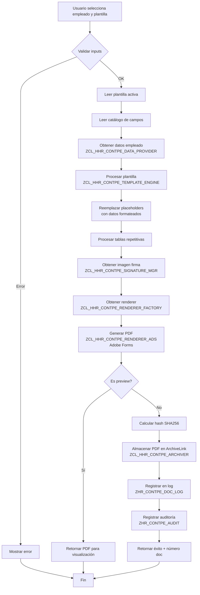
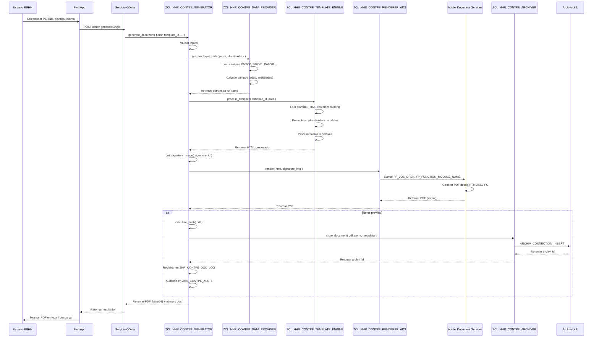
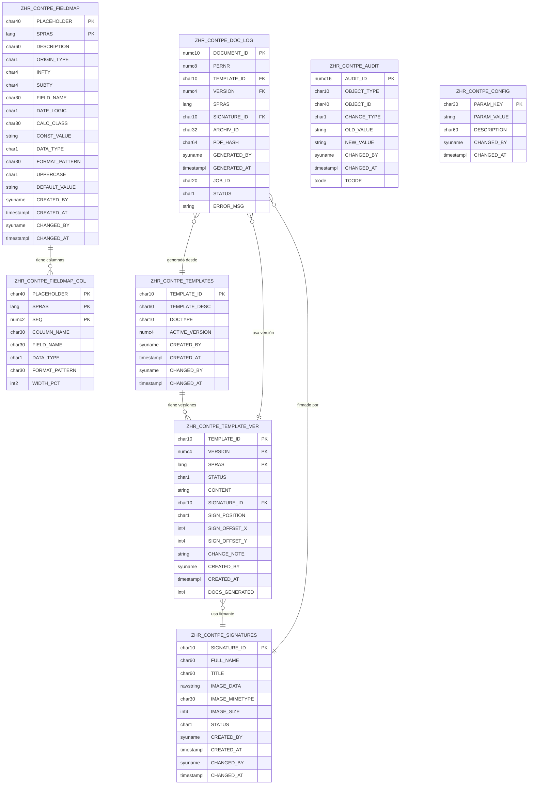

# Especificación Generador de Documentos PDF HCM - SAP S/4HANA

## 1. ESPECIFICACIÓN FUNCIONAL

### 1.1 Visión General

Aplicación que permite a usuarios de RRHH generar documentos PDF para empleados (certificados, cartas, contratos) usando plantillas mantenibles directamente en productivo sin transportes, con mapeo configurable de datos desde infotipos PA y trazabilidad completa.

### 1.2 Roles de Usuario

**Usuario RRHH Funcional (Principal)**
- Crear, editar, copiar y desactivar plantillas
- Mantener catálogo de mapeo de campos
- Generar documentos individuales y masivos
- Consultar histórico de documentos generados
- Gestionar repositorio de firmas

**Usuario RRHH Operativo**
- Generar documentos desde plantillas activas
- Consultar documentos generados
- Re-imprimir documentos

**Nota sobre autorizaciones**: El control de acceso será únicamente por transacción (S_TCODE). NO habrá restricciones adicionales de HR (P_ORGIN, P_PERNR). Todo usuario con acceso a la transacción tendrá permisos completos.

### 1.3 Casos de Uso Principales

#### CU-01: Mantener Plantilla de Documento

**Actor**: Usuario RRHH Funcional

**Flujo Principal**:
1. Usuario accede a gestión de plantillas
2. Sistema muestra lista de plantillas existentes (código, descripción, tipo documento, estado, versión activa, última modificación)
3. Usuario selecciona Crear Nueva / Editar Existente / Copiar
4. Sistema presenta editor de plantilla con:
   - Datos básicos: código plantilla (clave única), descripción, tipo documento, idioma
   - Editor de contenido con texto enriquecido
   - Barra de herramientas: negrita, cursiva, subrayado, alineación, fuentes, tamaños, color
   - Inserción de tablas, líneas, logos (desde repositorio de imágenes)
   - Panel lateral con placeholders disponibles (del catálogo de campos)
   - Configuración de firma: firmante por defecto, posición de firma
5. Usuario diseña documento insertando texto y placeholders (ej: "El empleado {{NOMBRE_COMPLETO}} ingresó el {{FECHA_INGRESO}}")
6. Usuario inserta tablas repetitivas (ej: tabla con registros IT0008)
7. Usuario configura sección de firma (posición, firmante)
8. Usuario previsualiza con datos de prueba (selecciona un PERNR de ejemplo)
9. Usuario guarda (Borrador) o activa plantilla
10. Sistema valida placeholders (todos existen en catálogo)
11. Si edita plantilla activa: sistema crea nueva versión, desactiva versión anterior
12. Sistema registra auditoría (usuario, fecha, cambios)

**Flujos Alternativos**:
- 3a. Usuario selecciona Desactivar: sistema marca plantilla como Obsoleta, no podrá usarse para nuevas generaciones
- 10a. Placeholder no existe: sistema alerta, permite continuar como Borrador pero no Activar
- 11a. Usuario cancela: cambios no se guardan, versión anterior permanece activa

**Validaciones**:
- Código plantilla único
- Al menos un idioma configurado
- Placeholders válidos para activar plantilla

#### CU-02: Mantener Catálogo de Campos (Mapeo)

**Actor**: Usuario RRHH Funcional

**Flujo Principal**:
1. Usuario accede a catálogo de campos
2. Sistema muestra lista de campos mapeados (placeholder, descripción, origen, tipo dato, formato)
3. Usuario selecciona Crear Nuevo / Editar
4. Sistema presenta formulario:
   - Placeholder (ej: NOMBRE_COMPLETO)
   - Descripción (ej: "Nombre completo del empleado")
   - Tipo origen: Infotipo Simple / Infotipo Tabla / Campo Calculado / Constante
   - Configuración específica según tipo:
     - **Infotipo Simple**: infotipo, campo, lógica fecha validez (vigente hoy, fecha específica, histórico)
     - **Infotipo Tabla**: infotipo, campos a incluir, criterios de selección, orden
     - **Campo Calculado**: fórmula o clase ABAP (ej: calcular antigüedad, obtener texto de cargo desde HRP1000)
     - **Constante**: valor fijo
   - Formato salida: tipo dato (texto, fecha, numérico, importe), formato fecha (DD.MM.YYYY, texto largo), decimales, mayúsculas, etc.
5. Usuario guarda mapeo
6. Sistema valida sintaxis y existencia de infotipo/campo
7. Sistema registra auditoría

**Ejemplos de Mapeos**:
- `NOMBRE_COMPLETO` → PA0002-VORNA + PA0002-NACHN (concatenado)
- `FECHA_INGRESO` → PA0000-BEGDA (primer registro IT0000), formato DD.MM.YYYY
- `FECHA_INGRESO_TEXTO` → PA0000-BEGDA, formato "01 de enero de 2020"
- `CENTRO_COSTE` → PA0001-KOSTL (registro vigente)
- `DESCRIPCION_CARGO` → PA0001-PLANS → HRP1000-STEXT (lookup)
- `EDAD` → Calculado desde PA0002-GBDAT
- `ANTIGUEDAD_AÑOS` → Calculado desde PA0000-BEGDA
- `TABLA_PRESTAMOS` → IT0045 (todos registros vigentes), campos: BEGDA, ENDDA, BETRG, WAERS
- `TABLA_SALARIO` → IT0008 (registro vigente), campos: LGART (texto), BETRG, WAERS

**Validaciones**:
- Placeholder único (sin espacios, alfanumérico + guion bajo)
- Infotipo y campo existen
- Fórmulas calculadas válidas

#### CU-03: Generar Documento Individual

**Actor**: Usuario RRHH Operativo

**Flujo Principal**:
1. Usuario accede a generación de documentos
2. Sistema presenta pantalla de selección:
   - PERNR (búsqueda con ayuda)
   - Plantilla (lista de plantillas activas, filtros por tipo)
   - Idioma
   - Firmante (opcional, override del configurado en plantilla)
3. Usuario introduce PERNR 12345678, selecciona plantilla "Certificado Laboral", idioma español
4. Usuario solicita Vista Previa
5. Sistema ejecuta motor de plantillas:
   - Lee plantilla y versión activa
   - Lee datos empleado según catálogo de mapeo
   - Aplica formatos configurados
   - Reemplaza placeholders
   - Inserta firma (imagen desde repositorio)
   - Genera PDF vía Adobe Forms
6. Sistema muestra PDF en visor
7. Usuario revisa y confirma Generar Definitivo
8. Sistema genera PDF, asigna número de documento, almacena en ArchiveLink
9. Sistema registra en log: PERNR, plantilla, versión, usuario, fecha, número documento
10. Sistema muestra mensaje de éxito y opción de descargar/imprimir

**Flujos Alternativos**:
- 5a. Empleado sin datos para placeholder: sistema inserta valor vacío o mensaje configurable
- 5b. Error en lectura de infotipo: sistema alerta, permite continuar u abortar
- 7a. Usuario cancela: no se genera documento definitivo, no se registra

**Resultado**: Documento PDF generado, almacenado y trazable

#### CU-04: Generar Documentos Masivos

**Actor**: Usuario RRHH Funcional

**Flujo Principal**:
1. Usuario accede a generación masiva
2. Sistema presenta pantalla de selección:
   - Rango PERNR / Área personal / Subdivisión personal / Upload archivo
   - Plantilla
   - Idioma
   - Firmante
   - Opciones: generar ZIP, enviar por email (futuro)
3. Usuario selecciona rango PERNR 10000000-19999999, área personal 1000, plantilla "Carta Anual"
4. Usuario ejecuta en background
5. Sistema programa job background:
   - Lee empleados en bloque (optimizado)
   - Para cada empleado: genera documento (lógica CU-03)
   - Registra log detallado (éxitos, errores)
6. Sistema notifica finalización (correo, alerta en sistema)
7. Usuario consulta log de ejecución:
   - Total empleados procesados
   - Documentos generados exitosamente
   - Errores (PERNR, motivo)
   - Opción de descargar todos los PDFs en ZIP
8. Usuario descarga ZIP con todos los PDFs generados

**Validaciones**:
- Mínimo 1 empleado en selección
- Máximo 10,000 empleados por ejecución (configurable)

#### CU-05: Consultar Histórico de Documentos

**Actor**: Usuario RRHH

**Flujo Principal**:
1. Usuario accede a histórico
2. Sistema presenta pantalla de búsqueda:
   - PERNR
   - Rango fechas generación
   - Plantilla
   - Usuario generador
   - Tipo documento
3. Usuario busca: PERNR 12345678, últimos 12 meses
4. Sistema muestra lista de documentos (tabla ALV):
   - Número documento
   - Fecha generación
   - Plantilla (descripción)
   - Versión plantilla
   - Usuario generador
   - Estado (almacenado, archivado)
   - Acciones: Ver PDF, Descargar, Re-imprimir
5. Usuario selecciona documento, opción Ver PDF
6. Sistema recupera PDF desde ArchiveLink y muestra en visor
7. Usuario puede descargar o imprimir

**Funcionalidades Adicionales**:
- Export a Excel de lista de documentos
- Descarga masiva de PDFs seleccionados

#### CU-06: Gestionar Versiones de Plantilla

**Actor**: Usuario RRHH Funcional

**Flujo Principal**:
1. Usuario accede a gestión de plantillas
2. Usuario selecciona plantilla específica
3. Usuario accede a opción "Historial de Versiones"
4. Sistema muestra lista de versiones:
   - Número versión
   - Estado (Borrador, Activa, Obsoleta)
   - Usuario que creó versión
   - Fecha creación
   - Comentarios de cambio
   - Número documentos generados con esta versión
   - Acciones: Ver detalle, Comparar, Restaurar
5. Usuario selecciona dos versiones y opción "Comparar"
6. Sistema muestra diferencias (diff textual o visual)
7. Usuario selecciona versión antigua y opción "Restaurar"
8. Sistema confirma acción (creará nueva versión a partir de la antigua)
9. Usuario confirma
10. Sistema crea nueva versión (siguiente número) copiando contenido de versión antigua
11. Nueva versión queda en estado Borrador, usuario puede revisarla y activarla

**Validaciones**:
- Solo se puede activar una versión por plantilla
- No se pueden eliminar versiones que tienen documentos generados

#### CU-07: Gestionar Repositorio de Firmas

**Actor**: Usuario RRHH Funcional

**Flujo Principal**:
1. Usuario accede a gestión de firmas
2. Sistema muestra lista de firmantes:
   - Código firmante
   - Nombre completo
   - Cargo
   - Imagen firma (thumbnail)
   - Estado (Activo/Inactivo)
3. Usuario selecciona Crear Nuevo / Editar
4. Sistema presenta formulario:
   - Código firmante (único)
   - Nombre completo
   - Cargo / título
   - Upload imagen de firma (PNG, JPG, transparente recomendado)
   - Estado
5. Usuario carga imagen de firma (resolución 300dpi, max 500KB)
6. Sistema valida formato y tamaño
7. Sistema almacena imagen y metadata
8. Usuario puede asignar firmante por defecto a plantillas específicas

**Validaciones**:
- Formatos permitidos: PNG, JPG, GIF
- Tamaño máximo: 500KB
- Dimensiones recomendadas: 200x100 px

### 1.4 Reglas de Negocio

**RN-01: Versionamiento de Plantillas**
- Cada modificación a plantilla Activa genera nueva versión automáticamente
- Solo una versión puede estar Activa por plantilla
- Estados: Borrador (editable, no usable), Activa (no editable, usable), Obsoleta (no editable, no usable, consulta histórica)
- Al activar nueva versión, versión anterior pasa a Obsoleta automáticamente

**RN-02: Validación de Placeholders**
- Plantilla solo puede activarse si todos los placeholders existen en catálogo
- Si se elimina campo del catálogo, sistema alerta sobre plantillas que lo usan
- Warnings pero no bloqueo: permite mantener plantillas con placeholders huérfanos en Borrador

**RN-03: Lectura de Infotipos**
- Por defecto: registro vigente a fecha actual (ENDDA = 99991231 o ENDDA >= hoy)
- Configurable: vigente a fecha específica, primer registro histórico, último registro
- Para infotipos sin fechas (algunos IT0002, IT0006): último registro actualizado

**RN-04: Datos Faltantes**
- Si placeholder no tiene dato para empleado: insertar texto configurable (ej: "N/A", vacío, "Sin información")
- Configurable a nivel de campo en catálogo

**RN-05: Tablas Repetitivas**
- Configurar en catálogo: criterios de selección (fechas, subtipo), orden, límite de registros
- Formateo de tabla: diseño configurable en plantilla (bordes, colores, encabezados)

**RN-06: Formato de Fechas y Números (Perú)**
- Fechas: DD.MM.YYYY (ej: 15.03.2024) o formato texto "15 de marzo de 2024"
- Números: separador miles coma, decimales punto (ej: 1,234.56)
- Moneda: símbolo antes del monto: S/ 1,234.56 (Sol peruano), US$ 1,234.56
- Configurable por campo en catálogo

**RN-07: Multilenguaje**
- Plantillas: una versión por idioma (ES, EN, etc.)
- Textos de aplicación: elementos de texto multilenguaje
- Descripciones de catálogo: multilenguaje
- Textos de dominios: usar función de lectura de textos por idioma

**RN-08: Auditoría y Trazabilidad**
- Log de cambios en plantillas: usuario, fecha, tipo cambio, versión
- Log de documentos generados: PERNR, plantilla, versión, usuario, fecha, número documento, hash del PDF (para futuro firma digital)
- Retención: según política de datos personales (GDPR/Ley 29733 Perú), mínimo 5 años

**RN-09: Protección de Datos Personales (Ley N° 29733 Perú)**
- Documentos generados: consentimiento implícito por relación laboral
- Acceso a datos: solo usuarios autorizados (S_TCODE)
- No almacenar datos sensibles innecesarios: salud, afiliación sindical, datos biométricos (salvo que el documento lo requiera explícitamente)
- Derecho de acceso: empleados pueden solicitar sus documentos generados (considerar portal futuro)

**RN-10: Firmas**
- Imagen de firma: PNG transparente recomendado
- Posición configurable: derecha, centro, izquierda, con offset X/Y
- Múltiples firmantes: soportar hasta 3 firmas por documento (fase futura)
- Firma digital: diseñar modelo para soportar hash y certificado digital (no implementar en fase 1)

### 1.5 Mockups Textuales de Pantallas

#### Pantalla Principal: Gestión de Plantillas (Fiori Elements)

```
┌─────────────────────────────────────────────────────────────────┐
│ Generador de Documentos PDF - Gestión de Plantillas            │
├─────────────────────────────────────────────────────────────────┤
│ [Crear Nueva] [Copiar]                                          │
│                                                                 │
│ Filtros: [Tipo Doc ▼] [Estado ▼] [Idioma ▼] [Buscar: ____]    │
│                                                                 │
│ ┌───────────────────────────────────────────────────────────┐ │
│ │ Código │ Descripción          │ Tipo Doc │ Estado  │ Ver │ │
│ ├───────────────────────────────────────────────────────────┤ │
│ │ CERT01 │ Certificado Laboral  │ Certif.  │ Activa  │ 3   │ │
│ │ CART01 │ Carta Anual          │ Carta    │ Activa  │ 2   │ │
│ │ CONT01 │ Contrato Plazo Fijo  │ Contrato │ Borrador│ 1   │ │
│ │ CERT02 │ Cert. Remuneraciones │ Certif.  │ Obsoleta│ 5   │ │
│ └───────────────────────────────────────────────────────────┘ │
│                                                                 │
│ [Editar] [Desactivar] [Historial Versiones]                    │
└─────────────────────────────────────────────────────────────────┘
```

#### Pantalla: Editor de Plantilla (Fiori con Rich Text Editor)

```
┌─────────────────────────────────────────────────────────────────┐
│ Editar Plantilla: CERT01 - Certificado Laboral (Versión 3)     │
├─────────────────────────────────────────────────────────────────┤
│ Datos Básicos:                                                  │
│ Código: CERT01           Descripción: Certificado Laboral      │
│ Tipo: [Certificado ▼]   Idioma: [Español ▼]                    │
│ Estado: ● Borrador ○ Activa                                     │
│                                                                 │
│ ┌─────────────────────────────────────────────────────────────┐ │
│ │ Contenido de la Plantilla:                                  │ │
│ │ [B] [I] [U] [Fuente▼] [Tamaño▼] [Color] [Tabla] [Logo]    │ │
│ │                                                              │ │
│ │ ┌────────────────────────────────────────────────────────┐ │ │
│ │ │ [Logo Empresa]                                         │ │ │
│ │ │                                                        │ │ │
│ │ │                   CERTIFICADO LABORAL                  │ │ │
│ │ │                                                        │ │ │
│ │ │ La empresa ACME S.A., identificada con RUC 123456789, │ │ │
│ │ │ certifica que el Sr(a). {{NOMBRE_COMPLETO}},          │ │ │
│ │ │ identificado(a) con DNI {{DNI}}, labora en nuestra    │ │ │
│ │ │ institución desde el {{FECHA_INGRESO_TEXTO}}.         │ │ │
│ │ │                                                        │ │ │
│ │ │ Actualmente se desempeña como {{DESCRIPCION_CARGO}}   │ │ │
│ │ │ en el área de {{NOMBRE_AREA}}.                        │ │ │
│ │ │                                                        │ │ │
│ │ │ Lima, {{FECHA_ACTUAL_TEXTO}}                          │ │ │
│ │ │                                                        │ │ │
│ │ │ _______________________________                        │ │ │
│ │ │ {{FIRMA_GERENTE_RRHH}}                                │ │ │
│ │ │ Gerente de Recursos Humanos                           │ │ │
│ │ └────────────────────────────────────────────────────────┘ │ │
│ └─────────────────────────────────────────────────────────────┘ │
│                                                                 │
│ ┌─ Placeholders Disponibles ─────────────────────────────────┐ │
│ │ [Buscar: ____]                                             │ │
│ │ • NOMBRE_COMPLETO (Nombre completo empleado)               │ │
│ │ • DNI (Documento identidad)                                │ │
│ │ • FECHA_INGRESO_TEXTO (Fecha ingreso texto largo)          │ │
│ │ • DESCRIPCION_CARGO (Descripción cargo actual)             │ │
│ │ • NOMBRE_AREA (Nombre área organizacional)                 │ │
│ │ [Insertar en cursor]                                       │ │
│ └────────────────────────────────────────────────────────────┘ │
│                                                                 │
│ Configuración Firma:                                            │
│ Firmante por defecto: [Gerente RRHH ▼]                         │
│ Posición: ○ Izquierda ● Centro ○ Derecha                       │
│                                                                 │
│ [Previsualizar] [Guardar Borrador] [Activar Plantilla] [Cancelar] │
└─────────────────────────────────────────────────────────────────┘
```

#### Pantalla: Catálogo de Campos

```
┌─────────────────────────────────────────────────────────────────┐
│ Catálogo de Campos (Mapeo de Placeholders)                     │
├─────────────────────────────────────────────────────────────────┤
│ [Crear Nuevo Campo]                                             │
│                                                                 │
│ Filtros: [Tipo Origen ▼] [Buscar: ____]                        │
│                                                                 │
│ ┌───────────────────────────────────────────────────────────┐ │
│ │ Placeholder     │ Descripción       │ Origen       │ Formato│ │
│ ├───────────────────────────────────────────────────────────┤ │
│ │ NOMBRE_COMPLETO │ Nombre completo   │ IT0002       │ Texto  │ │
│ │ DNI             │ Doc. identidad    │ IT0002       │ Texto  │ │
│ │ FECHA_INGRESO   │ Fecha ingreso     │ IT0000       │ Fecha  │ │
│ │ EDAD            │ Edad empleado     │ Calculado    │ Núm.   │ │
│ │ TABLA_SALARIO   │ Comp. salariales  │ IT0008-Tabla │ Tabla  │ │
│ └───────────────────────────────────────────────────────────┘ │
│                                                                 │
│ [Editar] [Eliminar] [Verificar Uso en Plantillas]              │
└─────────────────────────────────────────────────────────────────┘
```

#### Pantalla: Generación Individual

```
┌─────────────────────────────────────────────────────────────────┐
│ Generación de Documento Individual                              │
├─────────────────────────────────────────────────────────────────┤
│ Selección de Empleado:                                          │
│ PERNR: [________] [🔍 Búsqueda]                                │
│                                                                 │
│ Nombre: GARCÍA LÓPEZ, JUAN CARLOS                              │
│ DNI: 12345678      Área: Recursos Humanos                      │
│                                                                 │
│ Selección de Plantilla:                                         │
│ Plantilla: [Certificado Laboral ▼]                             │
│ Idioma:    [Español ▼]                                          │
│                                                                 │
│ Configuración Firma:                                            │
│ Firmante: [Gerente RRHH ▼] (dejar vacío para usar default)     │
│                                                                 │
│ [Vista Previa] [Generar Definitivo] [Cancelar]                 │
└─────────────────────────────────────────────────────────────────┘
```

#### Pantalla: Generación Masiva

```
┌─────────────────────────────────────────────────────────────────┐
│ Generación Masiva de Documentos                                 │
├─────────────────────────────────────────────────────────────────┤
│ Selección de Empleados:                                         │
│ ○ Rango PERNR: [________] a [________]                         │
│ ○ Área Personal: [____] Subdivisión: [____]                    │
│ ○ Upload Archivo: [Seleccionar archivo .txt/.xlsx]             │
│                                                                 │
│ Empleados seleccionados: 250                                    │
│                                                                 │
│ Configuración:                                                  │
│ Plantilla: [Carta Anual 2024 ▼]                                │
│ Idioma:    [Español ▼]                                          │
│ Firmante:  [Gerente General ▼]                                  │
│                                                                 │
│ Opciones:                                                       │
│ ☑ Generar en background                                         │
│ ☑ Notificar por email al finalizar                             │
│ ☑ Generar archivo ZIP con todos los PDFs                       │
│                                                                 │
│ [Ejecutar] [Cancelar]                                           │
└─────────────────────────────────────────────────────────────────┘
```

#### Pantalla: Histórico de Documentos

```
┌─────────────────────────────────────────────────────────────────┐
│ Histórico de Documentos Generados                               │
├─────────────────────────────────────────────────────────────────┤
│ Filtros:                                                        │
│ PERNR: [________]  Desde: [01.01.2024] Hasta: [31.12.2024]    │
│ Plantilla: [Todas ▼]  Usuario: [____]                          │
│                                                                 │
│ [Buscar] [Limpiar] [Exportar Excel]                            │
│                                                                 │
│ ┌───────────────────────────────────────────────────────────┐ │
│ │ Doc#  │ Fecha    │ PERNR │ Plantilla   │ Usuario │ Acción │ │
│ ├───────────────────────────────────────────────────────────┤ │
│ │ 10001 │15.03.24  │123456 │Cert.Laboral │JGARCIA  │[Ver]   │ │
│ │ 10002 │15.03.24  │789012 │Cert.Laboral │JGARCIA  │[Ver]   │ │
│ │ 10003 │14.03.24  │123456 │Carta Anual  │MLOPEZ   │[Ver]   │ │
│ │ 10004 │12.03.24  │345678 │Contrato     │ARUIZ    │[Ver]   │ │
│ └───────────────────────────────────────────────────────────┘ │
│                                                                 │
│ Resultados: 4 documentos encontrados                            │
│ [Descargar Seleccionados]                                       │
└─────────────────────────────────────────────────────────────────┘
```

---

## 2. ESPECIFICACIÓN TÉCNICA Y ARQUITECTURA

### 2.1 Stack Tecnológico Recomendado (Decisiones)

#### 2.1.1 Interfaz de Usuario: **Fiori Elements + Custom Fiori con RAP**

**Decisión**: Usar Fiori Elements para listas/búsquedas + Custom Fiori (SAPUI5) para editor de plantillas con Rich Text Editor.

**Justificación**:
- **A favor**:
  - S/4HANA 2023: soporte nativo RAP (ABAP RESTful Application Programming Model)
  - UX moderna, responsiva, accesible desde cualquier dispositivo
  - Fiori Elements genera UI automáticamente para listas, filtros, búsquedas (menos código)
  - Editor de plantillas requiere componente Rich Text (sap.ui.richtexteditor) no disponible en Dynpro
  - Integración natural con SAP Gateway/OData
  - Mejor experiencia para usuarios no técnicos
  - Futuro: fácil agregar features (drag&drop, WYSIWYG avanzado)

- **En contra**:
  - Mayor curva de aprendizaje vs. Dynpro (si equipo no tiene experiencia Fiori)
  - Requiere SAP Gateway/OData configurado
  - Componente Rich Text requiere configuración adicional

**Alternativa descartada: Dynpro/ALV**:
- Pros: equipo familiarizado, rápido de desarrollar
- Contras: UX anticuada, editor de texto enriquecido muy limitado (requeriría componente externo o HTML control con limitaciones), no responsiva
- **Conclusión**: Dynpro no es viable para el editor de plantillas que es el core de la aplicación

**Implementación**:
- Backend: RAP Business Object (CDS views, behavior definitions, servicios OData V4)
- Frontend: Fiori Elements (List Report, Object Page) + Custom Fiori App para editor
- Editor plantilla: SAPUI5 app con `sap.ui.richtexteditor.RichTextEditor` (basado en TinyMCE)

#### 2.1.2 Motor de Renderizado PDF: **Adobe Forms con ADS**

**Decisión**: Usar Adobe Forms (con Adobe Document Services) como motor principal.

**Justificación**:
- **A favor**:
  - ADS está disponible y licenciado en el entorno
  - Adobe Forms: estándar SAP para documentos complejos
  - Soporte completo para tablas dinámicas, estilos avanzados, logos, firmas
  - Diseñador visual (Adobe LiveCycle Designer) para prototipado
  - Alta calidad de output PDF (cumple estándares PDF/A)
  - Buena performance para volúmenes medios (100-1000 docs/mes)

- **En contra**:
  - Dependencia de ADS (licencia, disponibilidad del servicio)
  - Curva de aprendizaje de Adobe Forms
  - Depuración más compleja que otros métodos

**Alternativa evaluada: PDF generado con ABAP puro (cl_rspo_pdf_merge, iText wrapper, etc.)**:
- Pros: sin dependencia ADS, mayor control programático
- Contras: limitaciones de formateo avanzado (tablas, estilos), mayor esfuerzo de desarrollo, no hay WYSIWYG

**Alternativa evaluada: Herramienta externa (API REST de servicio PDF en cloud)**:
- Pros: potencialmente más flexible, features modernas
- Contras: dependencia externa, latencia de red, costo, seguridad de datos personales (enviar datos a cloud)

**Conclusión**: Adobe Forms es la opción óptima dado que ADS está disponible, es estándar SAP y cumple todos los requisitos.

**Arquitectura de Render (Patrón Strategy)**:

Diseñar capa de render desacoplada para permitir cambio de motor en futuro:

```
Interface: ZIF_HHR_CONTPE_RENDERER
  - RENDER( iv_template TYPE string, it_data TYPE any )
    RETURNING ro_pdf TYPE xstring

Implementaciones:
  - ZCL_HHR_CONTPE_RENDERER_ADS (Adobe Forms - implementación por defecto)
  - ZCL_HHR_CONTPE_RENDERER_NATIVE (reservado para futura implementación nativa)
  - ZCL_HHR_CONTPE_RENDERER_EXT (reservado para API externa)

Clase Factory:
  - ZCL_HHR_CONTPE_RENDERER_FACTORY
    - GET_RENDERER( ) RETURNING ro_renderer TYPE REF TO zif_hhr_contpe_renderer
    - Retorna implementación según configuración (tabla customizing)
```

**Flujo de generación con Adobe Forms**:

1. Clase orquestadora lee plantilla (HTML enriquecido + placeholders) desde BD
2. Motor de plantillas (ZCL_HHR_CONTPE_TEMPLATE_ENGINE) reemplaza placeholders con datos
3. HTML resultante se convierte a XSL-FO (XML Formatting Objects)
4. Se genera Adobe Form dinámicamente o se usa plantilla Adobe pre-diseñada
5. Se invoca ADS (función FP_JOB_OPEN, FP_FUNCTION_MODULE_NAME, ejecución, FP_JOB_CLOSE)
6. ADS retorna PDF (xstring)
7. PDF se almacena vía ArchiveLink

**Consideración: Plantillas Adobe pre-diseñadas vs. generación dinámica**

Dado que los usuarios mantendrán plantillas en HTML enriquecido (vía UI), la generación será **dinámica**: se construirá el XSL-FO en runtime a partir del HTML de la plantilla. Una Adobe Form "genérica" recibirá el XSL-FO y lo renderizará. Alternativamente, evaluar usar PDF-Based Forms directamente desde HTML (funciones como `CONVERT_OTF`, `CONVERT_ABAPSPOOLJOB_2_PDF`, o más moderno `CL_FP_*` con context dinámico).

**Recomendación final**: Usar **Adobe Interactive Forms / PDF-based Forms** con contexto dinámico, donde la plantilla Adobe es un "contenedor" genérico que recibe data structure con todo el contenido (HTML formateado, tablas, imágenes). Esto permite editar plantillas en BD sin tocar la Adobe Form.

#### 2.1.3 Almacenamiento de PDFs: **SAP ArchiveLink (Customizing para HCM)**

**Decisión**: Almacenar PDFs vía ArchiveLink con document class personalizado.

**Justificación**:
- **A favor**:
  - ArchiveLink ya está configurado en el entorno
  - Estándar SAP para almacenamiento de documentos
  - Integración con Object Linking (SAP_PA: vínculo a PERNR)
  - Políticas de retención/borrado automáticas
  - Recuperación eficiente vía Transaction OAOR, Transaction PA20/30 (visualización en maestro empleado)
  - Auditabilidad nativa
  - Soporta múltiples repositorios (SAP Content Server, almacenamiento externo)

- **En contra**:
  - Configuración inicial (document class, objetos de negocio, etc.)
  - Overhead de metadata

**Alternativa evaluada: Tabla Z (almacenamiento en BD)**:
- Pros: más simple, control total
- Contras: tablas muy grandes (BLOBs), problemas de performance, no integra con ecosistema SAP, no tiene políticas de retención

**Alternativa evaluada: DMS (Document Management System)**:
- Pros: gestión documental avanzada (workflow, versiones, check-in/out)
- Contras: DMS no está configurado en el entorno, mayor complejidad

**Conclusión**: ArchiveLink es la opción óptima.

**Configuración ArchiveLink**:

- **Document Class**: `Z_HR_CONTPE` (crear en Transaction OAC2)
- **Object Type**: `PREL` (Personal Data) o custom `Z_PREL_PDF`
- **Retention Period**: 7 años (configurable, Ley 29733 Perú: 5 años mínimo)
- **Storage System**: SAP Content Server (ya configurado)

**Proceso de almacenamiento**:

1. Generar PDF (xstring)
2. Crear metadata: PERNR, plantilla, versión, fecha, usuario
3. Llamar función `ARCHIV_CONNECTION_INSERT` o clase `CL_OAC_ARCHIV_CONNECTION`
4. ArchiveLink asigna documento ID (ARCHIV_ID)
5. Vincular documento a objeto de negocio (PREL + PERNR)
6. Guardar ARCHIV_ID en tabla de log (ZHR_CONTPE_DOC_LOG)

**Recuperación**:

1. Leer ARCHIV_ID de tabla de log
2. Llamar `ARCHIV_GET_CONNECTIONS` + `ARCHIV_DOCUMENT_DISPLAY` o `CL_OAC_ARCHIV_CONNECTION->get_document( )`
3. Recuperar xstring del PDF
4. Mostrar en visor (WD component o SAPUI5 PDFViewer)

#### 2.1.4 Editor de Texto Enriquecido: **sap.ui.richtexteditor (TinyMCE) en Fiori**

**Decisión**: Componente `sap.ui.richtexteditor.RichTextEditor` de SAPUI5 para el editor de plantillas.

**Justificación**:
- **A favor**:
  - Componente estándar SAPUI5 (basado en TinyMCE 4)
  - Soporte completo: negrita, cursiva, tablas, imágenes, listas, alineación, colores
  - Output HTML5 estándar
  - Extensible vía plugins
  - Buena UX, familiar para usuarios

- **En contra**:
  - Requiere cargar librería adicional (CDN o local)
  - TinyMCE puede tener limitaciones de licencia (verificar versión open source vs. comercial)

**Alternativa evaluada: Editor HTML custom (Quill.js, CKEditor)**:
- Pros: mayor control, features modernas
- Contras: integración manual con SAPUI5, no es estándar SAP

**Conclusión**: Usar `sap.ui.richtexteditor.RichTextEditor` por ser estándar SAP.

**Configuración**:

```javascript
new sap.ui.richtexteditor.RichTextEditor({
  editorType: sap.ui.richtexteditor.EditorType.TinyMCE4,
  width: "100%",
  height: "600px",
  customToolbar: true,
  showGroupFont: true,
  showGroupFontStyle: true,
  showGroupTextAlign: true,
  showGroupStructure: true,
  showGroupInsert: true,
  showGroupLink: false, // deshabilitar links externos por seguridad
  plugins: ["table", "lists", "image"],
  value: "{/templateContent}", // binding a modelo OData
  change: function(oEvent) {
    // validar placeholders, guardar cambios
  }
});
```

**Inserción de Placeholders**: botón custom que inserta texto `{{PLACEHOLDER}}` en posición del cursor.

**Inserción de Logos**: botón custom que abre diálogo para seleccionar imagen del repositorio (almacenadas en tabla Z o ArchiveLink), inserta ``.

**Tablas Repetitivas**: sintaxis especial tipo `{{TABLE_BEGIN:TABLA_SALARIO}}...{{TABLE_END}}` que el motor de plantillas procesará generando múltiples filas.

### 2.2 Arquitectura de Capas

```
┌─────────────────────────────────────────────────────────────────┐
│                     CAPA DE PRESENTACIÓN                        │
│  ┌──────────────────────┐  ┌──────────────────────────────┐   │
│  │ Fiori Elements Apps  │  │ Custom Fiori App (Editor)    │   │
│  │ - List Report        │  │ - RichTextEditor (TinyMCE)   │   │
│  │ - Object Page        │  │ - Preview PDF Viewer         │   │
│  │ - Search/Filter      │  │ - Placeholder Picker         │   │
│  └──────────────────────┘  └──────────────────────────────┘   │
│                           │                                     │
│                    SAPUI5 / Fiori Launchpad                     │
└─────────────────────────────────────────────────────────────────┘
                             │ OData V4 REST API
┌─────────────────────────────────────────────────────────────────┐
│                     CAPA DE SERVICIOS (RAP)                     │
│  ┌──────────────────────────────────────────────────────────┐  │
│  │ RAP Business Objects (CDS + Behavior Definitions)        │  │
│  │ - BO: Templates (CRUD, validations, actions)             │  │
│  │ - BO: Field Mappings (CRUD)                              │  │
│  │ - BO: Signatures (CRUD)                                  │  │
│  │ - BO: Document History (Read-only, search)               │  │
│  └──────────────────────────────────────────────────────────┘  │
│  ┌──────────────────────────────────────────────────────────┐  │
│  │ OData Services (Auto-generated from RAP)                 │  │
│  │ - ZUI_HHR_CONTPE_TEMPLATES_O4  (List + Edit Templates)         │  │
│  │ - ZUI_HHR_CONTPE_FIELDMAP_O4   (Field Mapping)                 │  │
│  │ - ZUI_HHR_CONTPE_GENERATE_O4   (Actions: Generate, Preview)    │  │
│  └──────────────────────────────────────────────────────────┘  │
└─────────────────────────────────────────────────────────────────┘
                             │ Llamadas a clases ABAP
┌─────────────────────────────────────────────────────────────────┐
│                  CAPA DE LÓGICA DE NEGOCIO                      │
│  ┌─────────────────────────────────────────────────────┐       │
│  │ ZCL_HHR_CONTPE_GENERATOR (Orquestador principal)       │       │
│  │ - generate_document( )                              │       │
│  │ - generate_mass( )                                  │       │
│  │ - preview_document( )                               │       │
│  └─────────────────────────────────────────────────────┘       │
│  ┌──────────────────┐  ┌──────────────────┐  ┌──────────────┐ │
│  │ ZCL_HHR_CONTPE   │  │ ZCL_HHR_CONTPE   │  │ ZCL_HHR_CONTPE│ │
│  │ _TEMPLATE_ENGINE │  │ _DATA_PROVIDER   │  │ _VALIDATOR   │ │
│  │ - parse()        │  │ - get_employee() │  │ - validate() │ │
│  │ - replace()      │  │ - get_infotype() │  │ - check_ph() │ │
│  │ - format()       │  │ - calc_fields()  │  │              │ │
│  └──────────────────┘  └──────────────────┘  └──────────────┘ │
│  ┌──────────────────┐  ┌──────────────────┐  ┌──────────────┐ │
│  │ ZCL_HHR_CONTPE   │  │ ZCL_HHR_CONTPE   │  │ ZCL_HHR_CONTPE│ │
│  │ _RENDERER_FACTORY│  │ _SIGNATURE_MGR   │  │ _ARCHIVER    │ │
│  │ - get_renderer() │  │ - get_signature()│  │ - store()    │ │
│  └──────────────────┘  └──────────────────┘  │ - retrieve() │ │
│           │                                   └──────────────┘ │
│  ┌────────▼─────────┐  ┌──────────────────┐                   │
│  │ ZIF_HHR_CONTPE   │  │ ZCL_HHR_CONTPE   │                   │
│  │ _RENDERER (I/F)  │◄─┤ _RENDERER_ADS    │                   │
│  └──────────────────┘  └──────────────────┘                   │
└─────────────────────────────────────────────────────────────────┘
                             │ Acceso a datos
┌─────────────────────────────────────────────────────────────────┐
│                    CAPA DE ACCESO A DATOS                       │
│  ┌──────────────────────────────────────────────────────────┐  │
│  │ CDS Views (lectura optimizada)                           │  │
│  │ - ZHR_CONTPE_I_TEMPLATES         (Templates con versiones)    │  │
│  │ - ZHR_CONTPE_I_FIELDMAP          (Mapeo de campos)            │  │
│  │ - ZHR_CONTPE_I_DOC_HISTORY       (Join log + templates)       │  │
│  │ - ZHR_CONTPE_I_EMPLOYEES         (Vista empleados PA0000/02)  │  │
│  └──────────────────────────────────────────────────────────┘  │
│  ┌──────────────────────────────────────────────────────────┐  │
│  │ Tablas Z (datos de aplicación)                           │  │
│  │ - ZHR_CONTPE_TEMPLATES        (Plantillas)                  │  │
│  │ - ZHR_CONTPE_TEMPLATE_VER     (Versiones de plantillas)     │  │
│  │ - ZHR_CONTPE_FIELDMAP         (Mapeo de campos)             │  │
│  │ - ZHR_CONTPE_SIGNATURES       (Firmantes)                   │  │
│  │ - ZHR_CONTPE_DOC_LOG          (Log generación documentos)   │  │
│  │ - ZHR_CONTPE_AUDIT            (Auditoría cambios)           │  │
│  └──────────────────────────────────────────────────────────┘  │
│  ┌──────────────────────────────────────────────────────────┐  │
│  │ Tablas SAP Estándar (read-only)                          │  │
│  │ - PA0000, PA0001, PA0002, PA0006, PA0008, PA0041, etc.  │  │
│  │ - HRP1000 (Organizational Management)                    │  │
│  │ - T500P, T001P (Áreas personal)                          │  │
│  └──────────────────────────────────────────────────────────┘  │
└─────────────────────────────────────────────────────────────────┘
                             │
┌─────────────────────────────────────────────────────────────────┐
│                   SISTEMAS EXTERNOS                             │
│  ┌────────────────┐  ┌──────────────────┐  ┌────────────────┐ │
│  │ Adobe Document │  │ SAP ArchiveLink  │  │ SMTP (emails)  │ │
│  │ Services (ADS) │  │ Content Server   │  │                │ │
│  └────────────────┘  └──────────────────┘  └────────────────┘ │
│  ┌────────────────────────────────────────────────────────────┐ │
│  │ Futura integración: API Firma Electrónica (placeholder)   │ │
│  └────────────────────────────────────────────────────────────┘ │
└─────────────────────────────────────────────────────────────────┘
```

**Principios de diseño**:

- **Separación de responsabilidades**: cada clase tiene una responsabilidad clara
- **Clean ABAP**: convenciones de nomenclatura, métodos cortos, legibles
- **Testabilidad**: interfaces para componentes clave (renderer, data provider), permitiendo mocks en unit tests
- **Extensibilidad**: patrón Strategy para render, fácil agregar nuevos motores
- **Performance**: CDS views para lectura optimizada, lectura de infotipos en bloque (no loop por empleado)

### 2.3 Modelo de Datos Completo

Todas las tablas son **datos de aplicación** (no customizing), para permitir edición en PRD sin transportes.

#### 2.3.1 Tabla: ZHR_CONTPE_TEMPLATES (Plantillas - Header)

**Propósito**: Catálogo de plantillas (info general, una entrada por plantilla)

**Campos**:

| Campo           | Tipo      | Long | Clave | Descripción                              |
|-----------------|-----------|------|-------|------------------------------------------|
| TEMPLATE_ID     | CHAR      | 10   | ✓     | ID plantilla (ej: CERT01)                |
| TEMPLATE_DESC   | CHAR      | 60   |       | Descripción (multilenguaje vía text tbl) |
| DOCTYPE         | CHAR      | 10   |       | Tipo doc (CERT,CARTA,CONTRATO,OTROS)     |
| ACTIVE_VERSION  | NUMC      | 4    |       | Versión activa actual (ej: 0003)         |
| CREATED_BY      | SYUNAME   |      |       | Usuario creación                         |
| CREATED_AT      | TIMESTAMPL|      |       | Timestamp creación                       |
| CHANGED_BY      | SYUNAME   |      |       | Último usuario cambio                    |
| CHANGED_AT      | TIMESTAMPL|      |       | Último timestamp cambio                  |

**Índices**:
- Primario: TEMPLATE_ID
- Secundario: DOCTYPE, ACTIVE_VERSION

**Tabla de textos**: ZHR_CONTPE_TEMPLATES_T (TEMPLATE_ID + SPRAS + TEMPLATE_DESC)

#### 2.3.2 Tabla: ZHR_CONTPE_TEMPLATE_VER (Versiones de Plantillas)

**Propósito**: Historial de versiones, cada modificación genera nueva versión

**Campos**:

| Campo           | Tipo      | Long | Clave | Descripción                              |
|-----------------|-----------|------|-------|------------------------------------------|
| TEMPLATE_ID     | CHAR      | 10   | ✓     | ID plantilla                             |
| VERSION         | NUMC      | 4    | ✓     | Número versión (0001, 0002, ...)         |
| SPRAS           | LANG      |      | ✓     | Idioma                                   |
| STATUS          | CHAR      | 1    |       | Estado: D=Borrador, A=Activa, O=Obsoleta |
| CONTENT         | STRING    |      |       | HTML enriquecido con placeholders        |
| SIGNATURE_ID    | CHAR      | 10   |       | ID firmante por defecto                  |
| SIGN_POSITION   | CHAR      | 1    |       | Posición firma: L/C/R (Left/Center/Right)|
| SIGN_OFFSET_X   | INT4      |      |       | Offset X en mm (opcional)                |
| SIGN_OFFSET_Y   | INT4      |      |       | Offset Y en mm (opcional)                |
| CHANGE_NOTE     | STRING    |      |       | Comentario de cambio                     |
| CREATED_BY      | SYUNAME   |      |       | Usuario que creó versión                 |
| CREATED_AT      | TIMESTAMPL|      |       | Timestamp creación versión               |
| DOCS_GENERATED  | INT4      |      |       | # documentos generados con esta versión  |

**Índices**:
- Primario: TEMPLATE_ID + VERSION + SPRAS
- Secundario: TEMPLATE_ID + STATUS (para encontrar versión activa rápido)

**Relaciones**:
- FK → ZHR_CONTPE_TEMPLATES (TEMPLATE_ID)
- FK → ZHR_CONTPE_SIGNATURES (SIGNATURE_ID)

**Reglas**:
- Solo un registro con STATUS='A' por TEMPLATE_ID + SPRAS
- DOCS_GENERATED se incrementa cada vez que se genera documento, para bloquear eliminación de versiones usadas

#### 2.3.3 Tabla: ZHR_CONTPE_FIELDMAP (Mapeo de Campos)

**Propósito**: Catálogo de placeholders y su origen de datos

**Campos**:

| Campo           | Tipo      | Long | Clave | Descripción                              |
|-----------------|-----------|------|-------|------------------------------------------|
| PLACEHOLDER     | CHAR      | 40   | ✓     | Nombre placeholder (ej: NOMBRE_COMPLETO) |
| SPRAS           | LANG      |      | ✓     | Idioma (para descripciones)              |
| DESCRIPTION     | CHAR      | 60   |       | Descripción del campo                    |
| ORIGIN_TYPE     | CHAR      | 1    |       | Tipo: I=Infotipo, T=Tabla, C=Calculado, K=Konstante |
| INFTY           | CHAR      | 4    |       | Infotipo (si ORIGIN_TYPE=I/T)            |
| SUBTY           | CHAR      | 4    |       | Subtipo (si aplica)                      |
| FIELD_NAME      | CHAR      | 30   |       | Campo ABAP (ej: VORNA, NACHN)            |
| DATE_LOGIC      | CHAR      | 1    |       | Lógica fecha: C=Current, F=First, L=Last |
| CALC_CLASS      | CHAR      | 30   |       | Clase ABAP para cálculo (si ORIGIN_TYPE=C) |
| CONST_VALUE     | STRING    |      |       | Valor constante (si ORIGIN_TYPE=K)       |
| DATA_TYPE       | CHAR      | 1    |       | Tipo dato: T=Text, D=Date, N=Numeric, A=Amount |
| FORMAT_PATTERN  | CHAR      | 30   |       | Patrón formato (ej: DD.MM.YYYY, #,##0.00) |
| UPPERCASE       | CHAR      | 1    |       | Convertir a mayúsculas: X=Sí, ' '=No     |
| DEFAULT_VALUE   | STRING    |      |       | Valor si no hay dato (ej: "N/A")         |
| CREATED_BY      | SYUNAME   |      |       | Usuario creación                         |
| CREATED_AT      | TIMESTAMPL|      |       | Timestamp creación                       |
| CHANGED_BY      | SYUNAME   |      |       | Usuario cambio                           |
| CHANGED_AT      | TIMESTAMPL|      |       | Timestamp cambio                         |

**Índices**:
- Primario: PLACEHOLDER + SPRAS
- Secundario: ORIGIN_TYPE, INFTY

**Relaciones**:
- No hay FK explícitas (infotipos son tablas estándar SAP)

**Ejemplos de configuración**:

| PLACEHOLDER        | ORIGIN_TYPE | INFTY | FIELD_NAME | DATE_LOGIC | DATA_TYPE | FORMAT_PATTERN | UPPERCASE |
|--------------------|-------------|-------|------------|------------|-----------|----------------|-----------|
| NOMBRE_COMPLETO    | I           | 0002  | VORNA+NACHN| C          | T         |                | X         |
| DNI                | I           | 0002  | PERID      | C          | T         |                |           |
| FECHA_INGRESO      | I           | 0000  | BEGDA      | F          | D         | DD.MM.YYYY     |           |
| EDAD               | C           |       |            |            | N         |                |           |
| TABLA_SALARIO      | T           | 0008  | *          | C          | T         |                |           |

**Para TABLA_SALARIO (infotipo tabla)**, necesitamos tabla adicional para configurar columnas:

#### 2.3.4 Tabla: ZHR_CONTPE_FIELDMAP_COL (Columnas de Tablas Repetitivas)

**Propósito**: Definir columnas para placeholders tipo Tabla

**Campos**:

| Campo           | Tipo      | Long | Clave | Descripción                              |
|-----------------|-----------|------|-------|------------------------------------------|
| PLACEHOLDER     | CHAR      | 40   | ✓     | Placeholder padre (FK)                   |
| SPRAS           | LANG      |      | ✓     | Idioma                                   |
| SEQ             | NUMC      | 2    | ✓     | Secuencia columna                        |
| COLUMN_NAME     | CHAR      | 30   |       | Nombre columna en tabla (ej: "Concepto") |
| FIELD_NAME      | CHAR      | 30   |       | Campo ABAP (ej: LGART)                   |
| DATA_TYPE       | CHAR      | 1    |       | Tipo dato                                |
| FORMAT_PATTERN  | CHAR      | 30   |       | Patrón formato                           |
| WIDTH_PCT       | INT2      |      |       | Ancho columna en % (opcional)            |

**Índices**:
- Primario: PLACEHOLDER + SPRAS + SEQ

**Relaciones**:
- FK → ZHR_CONTPE_FIELDMAP (PLACEHOLDER)

**Ejemplo para TABLA_SALARIO**:

| PLACEHOLDER     | SEQ | COLUMN_NAME        | FIELD_NAME | DATA_TYPE | FORMAT_PATTERN |
|-----------------|-----|--------------------|------------|-----------|----------------|
| TABLA_SALARIO   | 01  | Concepto           | LGART      | T         |                |
| TABLA_SALARIO   | 02  | Importe            | BETRG      | A         | #,##0.00       |
| TABLA_SALARIO   | 03  | Moneda             | WAERS      | T         |                |

#### 2.3.5 Tabla: ZHR_CONTPE_SIGNATURES (Firmantes)

**Propósito**: Catálogo de firmantes y sus imágenes de firma

**Campos**:

| Campo           | Tipo      | Long | Clave | Descripción                              |
|-----------------|-----------|------|-------|------------------------------------------|
| SIGNATURE_ID    | CHAR      | 10   | ✓     | ID firmante (ej: GRRHH01)                |
| FULL_NAME       | CHAR      | 60   |       | Nombre completo                          |
| TITLE           | CHAR      | 60   |       | Cargo / título                           |
| IMAGE_DATA      | RAWSTRING |      |       | Imagen firma (PNG/JPG, base64 o binario) |
| IMAGE_MIMETYPE  | CHAR      | 30   |       | MIME type (image/png, image/jpeg)        |
| IMAGE_SIZE      | INT4      |      |       | Tamaño en bytes                          |
| STATUS          | CHAR      | 1    |       | A=Activo, I=Inactivo                     |
| CREATED_BY      | SYUNAME   |      |       | Usuario creación                         |
| CREATED_AT      | TIMESTAMPL|      |       | Timestamp creación                       |
| CHANGED_BY      | SYUNAME   |      |       | Usuario cambio                           |
| CHANGED_AT      | TIMESTAMPL|      |       | Timestamp cambio                         |

**Índices**:
- Primario: SIGNATURE_ID

**Consideración**: Alternativamente, almacenar imágenes en ArchiveLink y guardar solo ARCHIV_ID aquí (para tablas más livianas). Decisión: almacenar directamente en tabla por simplicidad y rapidez de acceso.

#### 2.3.6 Tabla: ZHR_CONTPE_DOC_LOG (Log de Documentos Generados)

**Propósito**: Trazabilidad completa de documentos generados

**Campos**:

| Campo           | Tipo      | Long | Clave | Descripción                              |
|-----------------|-----------|------|-------|------------------------------------------|
| DOCUMENT_ID     | NUMC      | 10   | ✓     | ID documento (número secuencial)         |
| PERNR           | NUMC      | 8    |       | Número personal                          |
| TEMPLATE_ID     | CHAR      | 10   |       | ID plantilla usada                       |
| VERSION         | NUMC      | 4    |       | Versión plantilla usada                  |
| SPRAS           | LANG      |      |       | Idioma documento                         |
| SIGNATURE_ID    | CHAR      | 10   |       | Firmante usado                           |
| ARCHIV_ID       | CHAR      | 32   |       | ID documento en ArchiveLink              |
| PDF_HASH        | CHAR      | 64   |       | SHA256 hash del PDF (para integridad)   |
| GENERATED_BY    | SYUNAME   |      |       | Usuario que generó                       |
| GENERATED_AT    | TIMESTAMPL|      |       | Timestamp generación                     |
| JOB_ID          | CHAR      | 20   |       | ID job background (si generación masiva) |
| STATUS          | CHAR      | 1    |       | S=Success, E=Error                       |
| ERROR_MSG       | STRING    |      |       | Mensaje error (si STATUS=E)              |

**Índices**:
- Primario: DOCUMENT_ID
- Secundario: PERNR + GENERATED_AT (consulta histórico por empleado)
- Secundario: TEMPLATE_ID + VERSION (consulta documentos por plantilla)
- Secundario: GENERATED_BY + GENERATED_AT (consulta por usuario)
- Secundario: JOB_ID (agrupar documentos de generación masiva)

**Relaciones**:
- FK → ZHR_CONTPE_TEMPLATES (TEMPLATE_ID)
- FK → ZHR_CONTPE_TEMPLATE_VER (TEMPLATE_ID + VERSION)
- FK → PA0000 (PERNR)

**Campos adicionales para firma digital futura**:

| Campo           | Tipo      | Long | Descripción                              |
|-----------------|-----------|------|------------------------------------------|
| DIGITAL_SIGN    | CHAR      | 1    | X=Firmado digitalmente                   |
| SIGN_CERT_ID    | CHAR      | 40   | ID certificado digital                   |
| SIGN_TIMESTAMP  | TIMESTAMPL|      | Timestamp firma digital                  |
| SIGN_PROVIDER   | CHAR      | 30   | Proveedor firma electrónica              |

(Dejar campos en blanco en fase 1, llenar en fase futura)

#### 2.3.7 Tabla: ZHR_CONTPE_AUDIT (Auditoría de Cambios)

**Propósito**: Log de cambios en plantillas y configuración

**Campos**:

| Campo           | Tipo      | Long | Clave | Descripción                              |
|-----------------|-----------|------|-------|------------------------------------------|
| AUDIT_ID        | NUMC      | 16   | ✓     | ID auditoría (UUID o secuencial)         |
| OBJECT_TYPE     | CHAR      | 10   |       | Tipo objeto: TEMPLATE, FIELDMAP, SIGNATURE |
| OBJECT_ID       | CHAR      | 40   |       | ID objeto (TEMPLATE_ID, PLACEHOLDER, etc) |
| CHANGE_TYPE     | CHAR      | 1    |       | Tipo cambio: C=Create, U=Update, D=Delete |
| OLD_VALUE       | STRING    |      |       | Valor anterior (JSON)                    |
| NEW_VALUE       | STRING    |      |       | Valor nuevo (JSON)                       |
| CHANGED_BY      | SYUNAME   |      |       | Usuario                                  |
| CHANGED_AT      | TIMESTAMPL|      |       | Timestamp                                |
| TCODE           | TCODE     |      |       | Transacción usada                        |

**Índices**:
- Primario: AUDIT_ID
- Secundario: OBJECT_TYPE + OBJECT_ID + CHANGED_AT

**Población**: Trigger automático en RAP (save triggers) o explícito en clases de negocio.

#### 2.3.8 Tabla: ZHR_CONTPE_CONFIG (Configuración General)

**Propósito**: Parámetros de configuración de la aplicación

**Campos**:

| Campo           | Tipo      | Long | Clave | Descripción                              |
|-----------------|-----------|------|-------|------------------------------------------|
| PARAM_KEY       | CHAR      | 30   | ✓     | Clave parámetro                          |
| PARAM_VALUE     | STRING    |      |       | Valor                                    |
| DESCRIPTION     | CHAR      | 60   |       | Descripción                              |
| CHANGED_BY      | SYUNAME   |      |       | Usuario cambio                           |
| CHANGED_AT      | TIMESTAMPL|      |       | Timestamp cambio                         |

**Ejemplos de configuración**:

| PARAM_KEY                | PARAM_VALUE        | DESCRIPTION                              |
|--------------------------|-------------------|------------------------------------------|
| RENDERER_TYPE            | ADS               | Motor PDF: ADS, NATIVE, EXTERNAL         |
| MAX_MASS_GENERATION      | 10000             | Máximo empleados por generación masiva   |
| DEFAULT_SIGNATURE_ID     | GRRHH01           | Firmante por defecto                     |
| ARCHIVELINK_DOC_CLASS    | Z_HR_CONTPE           | Document class ArchiveLink               |
| ARCHIVELINK_OBJECT_TYPE  | Z_PREL_PDF        | Object type ArchiveLink                  |
| RETENTION_YEARS          | 7                 | Años retención documentos                |
| DIGITAL_SIGN_ENABLED     | N                 | Firma digital habilitada: Y/N            |
| DIGITAL_SIGN_PROVIDER    |                   | Proveedor API firma digital (futuro)     |

**Acceso**: Clase helper `ZCL_HHR_CONTPE_CONFIG->get_parameter( 'RENDERER_TYPE' )`.

### 2.4 Diseño de Clases Principales

Todas las clases en un único paquete `ZHR_CONTPE`.

#### Clase: ZCL_HHR_CONTPE_GENERATOR (Orquestador)

**Responsabilidad**: Punto de entrada principal, orquesta el proceso de generación.

**Métodos públicos**:

```abap
METHOD generate_document
  IMPORTING
    iv_pernr         TYPE persno
    iv_template_id   TYPE zde_contpe_template_id
    iv_language      TYPE spras DEFAULT sy-langu
    iv_signature_id  TYPE zde_contpe_signature_id OPTIONAL
    iv_preview       TYPE abap_bool DEFAULT abap_false
  RETURNING
    VALUE(rv_pdf)    TYPE xstring
  RAISING
    zcx_hhr_contpe_generation_error.

METHOD generate_mass
  IMPORTING
    it_pernr_list    TYPE zhr_tt_pernr
    iv_template_id   TYPE zde_contpe_template_id
    iv_language      TYPE spras DEFAULT sy-langu
    iv_signature_id  TYPE zde_contpe_signature_id OPTIONAL
    iv_background    TYPE abap_bool DEFAULT abap_true
  RETURNING
    VALUE(rv_job_id) TYPE zde_contpe_job_id
  RAISING
    zcx_hhr_contpe_generation_error.

METHOD get_document_history
  IMPORTING
    iv_pernr         TYPE persno OPTIONAL
    iv_date_from     TYPE datum OPTIONAL
    iv_date_to       TYPE datum OPTIONAL
    iv_template_id   TYPE zde_contpe_template_id OPTIONAL
  RETURNING
    VALUE(rt_docs)   TYPE zhr_tt_doc_log.

METHOD retrieve_document
  IMPORTING
    iv_document_id   TYPE zde_contpe_document_id
  RETURNING
    VALUE(rv_pdf)    TYPE xstring
  RAISING
    zcx_pdf_doc_not_found.
```

**Lógica interna**:
1. Validar inputs (PERNR existe, plantilla activa, etc.)
2. Llamar `ZCL_HHR_CONTPE_DATA_PROVIDER` para obtener datos empleado
3. Llamar `ZCL_HHR_CONTPE_TEMPLATE_ENGINE` para procesar plantilla
4. Llamar `ZCL_HHR_CONTPE_RENDERER_FACTORY` para obtener renderer
5. Generar PDF
6. Si no es preview: llamar `ZCL_HHR_CONTPE_ARCHIVER` para almacenar
7. Registrar en log
8. Retornar PDF

#### Clase: ZCL_HHR_CONTPE_TEMPLATE_ENGINE

**Responsabilidad**: Procesar plantilla, reemplazar placeholders, aplicar formatos.

**Métodos públicos**:

```abap
METHOD process_template
  IMPORTING
    iv_template_id   TYPE zde_contpe_template_id
    iv_version       TYPE zde_contpe_version OPTIONAL "Si no se pasa, usa activa
    iv_language      TYPE spras DEFAULT sy-langu
    is_data          TYPE zhr_s_employee_data
  RETURNING
    VALUE(rv_html)   TYPE string
  RAISING
    zcx_pdf_doc_template_error.

METHOD validate_placeholders
  IMPORTING
    iv_template_id   TYPE zde_contpe_template_id
    iv_version       TYPE zde_contpe_version
  RETURNING
    VALUE(rt_missing) TYPE zhr_tt_placeholder
  RAISING
    zcx_pdf_doc_template_error.
```

**Lógica interna**:
1. Leer plantilla (HTML con placeholders)
2. Parsear placeholders (regex `\{\{([A-Z0-9_]+)\}\}`)
3. Para cada placeholder:
   - Buscar en catálogo de campos
   - Obtener valor desde `is_data` (estructura pre-cargada)
   - Aplicar formato según configuración
   - Reemplazar placeholder con valor formateado
4. Procesar tablas repetitivas: buscar `{{TABLE_BEGIN:XXX}}...{{TABLE_END}}`, generar filas HTML
5. Retornar HTML completo

#### Clase: ZCL_HHR_CONTPE_DATA_PROVIDER

**Responsabilidad**: Obtener datos del empleado y de infotipos según catálogo de mapeo.

**Métodos públicos**:

```abap
METHOD get_employee_data
  IMPORTING
    iv_pernr         TYPE persno
    it_placeholders  TYPE zhr_tt_placeholder "Lista de placeholders necesarios
    iv_date          TYPE datum DEFAULT sy-datum
  RETURNING
    VALUE(rs_data)   TYPE zhr_s_employee_data
  RAISING
    zcx_pdf_doc_data_error.

METHOD get_infotype_data
  IMPORTING
    iv_pernr         TYPE persno
    iv_infty         TYPE infty
    iv_subty         TYPE subty OPTIONAL
    iv_date_logic    TYPE zde_contpe_date_logic
    iv_date          TYPE datum DEFAULT sy-datum
  RETURNING
    VALUE(rt_data)   TYPE any "Tabla interna del infotipo
  RAISING
    zcx_pdf_doc_data_error.

METHOD calculate_field
  IMPORTING
    iv_placeholder   TYPE zde_contpe_placeholder
    iv_pernr         TYPE persno
    iv_date          TYPE datum DEFAULT sy-datum
  RETURNING
    VALUE(rv_value)  TYPE string
  RAISING
    zcx_pdf_doc_calc_error.
```

**Lógica interna**:

`get_employee_data`:
1. Leer catálogo de mapeo para los placeholders requeridos
2. Agrupar por infotipo para lectura optimizada
3. Llamar funciones SAP HR estándar: `HR_READ_INFOTYPE`, `HR_READ_SUBTYPE` (o lógicas RP*)
4. Para infotipos en batch: usar `RH_READ_INFTY_TABLE` o CDS views
5. Para campos calculados: llamar `calculate_field`
6. Para constantes: retornar valor directo
7. Construir estructura `zhr_s_employee_data` con todos los valores
8. Retornar estructura

`get_infotype_data`:
1. Según `iv_date_logic`:
   - C (Current): registros vigentes a `iv_date` (BEGDA <= iv_date AND ENDDA >= iv_date)
   - F (First): primer registro histórico (ORDER BY BEGDA ASC)
   - L (Last): último registro (ORDER BY BEGDA DESC)
2. Llamar función de lectura de infotipo
3. Retornar tabla interna

`calculate_field`:
1. Leer `CALC_CLASS` del catálogo
2. Instanciar clase calculadora (interface `ZIF_HHR_CONTPE_FIELD_CALC`)
3. Llamar método `calculate( iv_pernr, iv_date )`
4. Retornar valor

**Clases calculadoras ejemplo** (implementan `ZIF_HHR_CONTPE_FIELD_CALC`):
- `ZCL_HHR_CONTPE_EDAD`: calcula edad desde PA0002-GBDAT
- `ZCL_HHR_CONTPE_ANTIGUEDAD`: calcula años desde PA0000-BEGDA
- `ZCL_HHR_CONTPE_DESC_CARGO`: lookup de HRP1000 usando PA0001-PLANS

#### Clase: ZCL_HHR_CONTPE_RENDERER_FACTORY (Factory + Strategy)

**Responsabilidad**: Retornar instancia del renderer configurado.

**Métodos públicos**:

```abap
METHOD get_renderer
  RETURNING
    VALUE(ro_renderer) TYPE REF TO zif_hhr_contpe_renderer.
```

**Lógica interna**:
1. Leer configuración: `ZCL_HHR_CONTPE_CONFIG->get_parameter( 'RENDERER_TYPE' )`
2. Según valor:
   - 'ADS': retornar `NEW zcl_hhr_contpe_renderer_ads( )`
   - 'NATIVE': retornar `NEW zcl_pdf_doc_renderer_native( )` (futuro)
   - 'EXTERNAL': retornar `NEW zcl_pdf_doc_renderer_ext( )` (futuro)
3. Si no configurado: default ADS

#### Interface: ZIF_HHR_CONTPE_RENDERER

**Responsabilidad**: Contrato para motores de renderizado.

**Métodos**:

```abap
INTERFACE zif_hhr_contpe_renderer.
  METHODS render
    IMPORTING
      iv_html          TYPE string
      iv_signature_img TYPE xstring OPTIONAL
      is_metadata      TYPE zhr_s_pdf_metadata OPTIONAL
    RETURNING
      VALUE(rv_pdf)    TYPE xstring
    RAISING
      zcx_pdf_doc_render_error.
ENDINTERFACE.
```

#### Clase: ZCL_HHR_CONTPE_RENDERER_ADS (Implementación Adobe)

**Responsabilidad**: Generar PDF vía Adobe Forms / ADS.

**Métodos públicos**: implementa `ZIF_HHR_CONTPE_RENDERER`.

**Lógica interna del método `render`**:

1. Preparar estructura de datos para Adobe Form:
   ```abap
   DATA ls_form_data TYPE zde_contpe_ads_form_data.
   ls_form_data-html_content = iv_html.
   ls_form_data-signature_img = iv_signature_img.
   ls_form_data-metadata = is_metadata.
   ```

2. Abrir job Adobe:
   ```abap
   CALL FUNCTION 'FP_JOB_OPEN'
     CHANGING
       ie_outputparams = ls_output_params
     EXCEPTIONS
       usage_error     = 1
       system_error    = 2
       OTHERS          = 3.
   ```

3. Obtener nombre función módulo Adobe Form (usar form genérico `ZHR_CONTPE_F_001`):
   ```abap
   CALL FUNCTION 'FP_FUNCTION_MODULE_NAME'
     EXPORTING
       i_name     = 'ZHR_CONTPE_F_001'
     IMPORTING
       e_funcname = lv_func_name.
   ```

4. Llamar función módulo generado:
   ```abap
   CALL FUNCTION lv_func_name
     EXPORTING
       /1bcdwb/docparams  = ls_doc_params
       is_form_data       = ls_form_data
     IMPORTING
       /1bcdwb/formoutput = ls_form_output
     EXCEPTIONS
       usage_error        = 1
       system_error       = 2
       OTHERS             = 3.
   ```

5. Cerrar job:
   ```abap
   CALL FUNCTION 'FP_JOB_CLOSE'.
   ```

6. Extraer PDF:
   ```abap
   rv_pdf = ls_form_output-pdf.
   ```

7. Manejo de errores: si cualquier paso falla, raise `zcx_pdf_doc_render_error`.

**Adobe Form genérico**: `ZHR_CONTPE_F_001`

- Interface: importar `is_form_data` (HTML content, signature, metadata)
- Layout: campo de texto con binding a `is_form_data-html_content` (interpret as HTML)
- Subform de firma con imagen binding a `is_form_data-signature_img`
- Layout dinámico: se ajusta al contenido HTML

**Consideración**: Alternativamente, si HTML es complejo, convertir HTML a XSL-FO antes de pasarlo a Adobe Form. Evaluar en prototipo si Adobe Form interpreta HTML directamente o necesita XSL-FO.

#### Clase: ZCL_HHR_CONTPE_ARCHIVER

**Responsabilidad**: Almacenar y recuperar PDFs vía ArchiveLink.

**Métodos públicos**:

```abap
METHOD store_document
  IMPORTING
    iv_pdf           TYPE xstring
    iv_pernr         TYPE persno
    iv_document_id   TYPE zde_contpe_document_id
    is_metadata      TYPE zhr_s_pdf_metadata
  RETURNING
    VALUE(rv_archiv_id) TYPE archiv_id
  RAISING
    zcx_hhr_contpe_archive_error.

METHOD retrieve_document
  IMPORTING
    iv_archiv_id     TYPE archiv_id
  RETURNING
    VALUE(rv_pdf)    TYPE xstring
  RAISING
    zcx_hhr_contpe_archive_error.
```

**Lógica interna del método `store_document`**:

1. Preparar estructura TOA_DARA (ArchiveLink document info):
   ```abap
   DATA ls_doc_info TYPE toa_dara.
   ls_doc_info-arc_doc_id = lv_new_archiv_id. "Generado
   ls_doc_info-ar_object  = 'Z_PREL_PDF'. "Custom object type
   ls_doc_info-sap_object = 'PREL'.
   ls_doc_info-object_id  = |{ iv_pernr ALPHA = IN }|.
   ls_doc_info-ar_date    = sy-datum.
   ls_doc_info-creator    = sy-uname.
   ls_doc_info-doc_type   = 'PDF'.
   ```

2. Llamar función ArchiveLink para insertar:
   ```abap
   CALL FUNCTION 'ARCHIV_CONNECTION_INSERT'
     EXPORTING
       archiv_id                = ls_doc_info-arc_doc_id
       ar_object                = ls_doc_info-ar_object
       sap_object               = ls_doc_info-sap_object
       object_id                = ls_doc_info-object_id
       doc_type                 = ls_doc_info-doc_type
     TABLES
       binarchivobject          = lt_pdf_binary
     EXCEPTIONS
       error_connectiontable    = 1
       OTHERS                   = 2.
   ```

3. Convertir xstring PDF a tabla binaria:
   ```abap
   lt_pdf_binary = zcl_hhr_contpe_utils=>xstring_to_binary( iv_pdf ).
   ```

4. Retornar `rv_archiv_id`.

**Lógica interna del método `retrieve_document`**:

1. Llamar función ArchiveLink para recuperar:
   ```abap
   CALL FUNCTION 'ARCHIV_GET_CONNECTIONS'
     EXPORTING
       archiv_id            = iv_archiv_id
     IMPORTING
       archiv_doc_id        = lv_archiv_doc_id
     EXCEPTIONS
       nothing_found        = 1
       OTHERS               = 2.
   ```

2. Recuperar binario:
   ```abap
   CALL FUNCTION 'SCMS_DOC_READ'
     EXPORTING
       archiv_id         = iv_archiv_id
     TABLES
       binarchivobject   = lt_pdf_binary
     EXCEPTIONS
       error_archiv      = 1
       OTHERS            = 2.
   ```

3. Convertir binario a xstring:
   ```abap
   rv_pdf = zcl_hhr_contpe_utils=>binary_to_xstring( lt_pdf_binary ).
   ```

4. Retornar PDF.

#### Clase: ZCL_HHR_CONTPE_VALIDATOR

**Responsabilidad**: Validaciones de negocio (placeholders, plantillas, datos).

**Métodos públicos**:

```abap
METHOD validate_template
  IMPORTING
    iv_template_id   TYPE zde_contpe_template_id
    iv_version       TYPE zde_contpe_version
  RETURNING
    VALUE(rt_errors) TYPE zhr_tt_validation_error.

METHOD check_placeholder_exists
  IMPORTING
    iv_placeholder   TYPE zde_contpe_placeholder
  RETURNING
    VALUE(rv_exists) TYPE abap_bool.

METHOD validate_employee_data
  IMPORTING
    iv_pernr         TYPE persno
    iv_date          TYPE datum DEFAULT sy-datum
  RETURNING
    VALUE(rt_errors) TYPE zhr_tt_validation_error.
```

**Lógica interna**:

`validate_template`:
1. Leer plantilla (HTML content)
2. Extraer todos los placeholders con regex
3. Para cada placeholder: verificar si existe en catálogo (llamar `check_placeholder_exists`)
4. Si no existe: agregar a tabla de errores
5. Retornar tabla de errores

`validate_employee_data`:
1. Verificar que PERNR existe en PA0000
2. Verificar que employee tiene infotipos mínimos (IT0001, IT0002)
3. Retornar tabla de errores/warnings

#### Clase: ZCL_HHR_CONTPE_SIGNATURE_MGR

**Responsabilidad**: Gestión de firmas (obtener imagen, validar).

**Métodos públicos**:

```abap
METHOD get_signature_image
  IMPORTING
    iv_signature_id  TYPE zde_contpe_signature_id
  RETURNING
    VALUE(rv_image)  TYPE xstring
  RAISING
    zcx_pdf_doc_signature_error.

METHOD validate_signature
  IMPORTING
    iv_signature_id  TYPE zde_contpe_signature_id
  RETURNING
    VALUE(rv_valid)  TYPE abap_bool.
```

**Lógica interna**:

`get_signature_image`:
1. Leer tabla `ZHR_CONTPE_SIGNATURES` con `iv_signature_id`
2. Verificar STATUS = 'A' (Activo)
3. Retornar `IMAGE_DATA` (xstring)
4. Si no existe o inactivo: raise exception

#### Clase de utilidades: ZCL_HHR_CONTPE_UTILS

**Responsabilidad**: Utilidades comunes (formateo, conversiones, hash).

**Métodos públicos**:

```abap
METHOD format_date
  IMPORTING
    iv_date          TYPE datum
    iv_format        TYPE zde_contpe_format_pattern
    iv_language      TYPE spras DEFAULT sy-langu
  RETURNING
    VALUE(rv_text)   TYPE string.

METHOD format_amount
  IMPORTING
    iv_amount        TYPE bapicurr
    iv_currency      TYPE waers
    iv_format        TYPE zde_contpe_format_pattern OPTIONAL
  RETURNING
    VALUE(rv_text)   TYPE string.

METHOD calculate_hash
  IMPORTING
    iv_pdf           TYPE xstring
  RETURNING
    VALUE(rv_hash)   TYPE zde_contpe_pdf_hash.

METHOD xstring_to_binary
  IMPORTING
    iv_xstring       TYPE xstring
  RETURNING
    VALUE(rt_binary) TYPE solix_tab.

METHOD binary_to_xstring
  IMPORTING
    it_binary        TYPE solix_tab
  RETURNING
    VALUE(rv_xstring) TYPE xstring.
```

**Lógica interna**:

`format_date`:
- Convertir datum a string según patrón: `DD.MM.YYYY`, `YYYY-MM-DD`, o texto largo "01 de enero de 2024" (usar función `RKE_MONTH_NAME_GET`, concatenar)

`format_amount`:
- Usar función `CURRENCY_AMOUNT_DISPLAY` o lógica custom para formatear con separadores y símbolo de moneda

`calculate_hash`:
- Llamar clase `CL_ABAP_HMAC` con algoritmo SHA256 para generar hash del PDF

#### Clases de excepción

Todas heredan de `ZCX_HHR_CONTPE_BASE_ERROR` (heredar de `CX_STATIC_CHECK`).

- `ZCX_HHR_CONTPE_GENERATION_ERROR`: error en generación de documento
- `ZCX_HHR_CONTPE_TEMPLATE_ERROR`: error en procesamiento de plantilla
- `ZCX_HHR_CONTPE_DATA_ERROR`: error en obtención de datos
- `ZCX_HHR_CONTPE_RENDER_ERROR`: error en renderizado PDF
- `ZCX_HHR_CONTPE_ARCHIVE_ERROR`: error en almacenamiento ArchiveLink
- `ZCX_HHR_CONTPE_NOT_FOUND`: documento no encontrado
- `ZCX_HHR_CONTPE_SIGNATURE_ERROR`: error en firma
- `ZCX_HHR_CONTPE_CALC_ERROR`: error en cálculo de campo

Todas con atributos: `textid`, `previous` (chaining), `error_message`.

### 2.5 RAP Business Objects y Servicios OData

#### RAP BO: Templates

**CDS Views**:

```sql
-- Interface view (datos de BD)
@AccessControl.authorizationCheck: #CHECK
define view entity ZHR_CONTPE_I_TEMPLATES
  as select from zhr_contpe_templates as Templates
  association [0..*] to ZHR_CONTPE_I_TEMPLATE_VER as _Versions
    on $projection.TemplateId = _Versions.TemplateId
{
  key template_id    as TemplateId,
      template_desc  as TemplateDesc,
      doctype        as Doctype,
      active_version as ActiveVersion,
      created_by     as CreatedBy,
      created_at     as CreatedAt,
      changed_by     as ChangedBy,
      changed_at     as ChangedAt,
      _Versions
}
```

```sql
-- Consumption view (proyección Fiori)
@EndUserText.label: 'PDF Templates'
@Metadata.allowExtensions: true
@Search.searchable: true
define root view entity ZHR_CONTPE_C_TEMPLATES
  provider contract transactional_query
  as projection on ZHR_CONTPE_I_TEMPLATES
{
  key TemplateId,
      @Search.defaultSearchElement: true
      TemplateDesc,
      Doctype,
      ActiveVersion,
      CreatedBy,
      CreatedAt,
      ChangedBy,
      ChangedAt,
      _Versions : redirected to composition child ZHR_CONTPE_C_TEMPLATE_VER
}
```

**Behavior Definition**:

```abap
managed implementation in class zbp_hhr_contpe_i_templates unique;
strict ( 2 );

define behavior for ZHR_CONTPE_I_TEMPLATES alias Template
persistent table zhr_contpe_templates
lock master
authorization master ( global )
{
  create;
  update;
  delete;
  
  association _Versions { create; }
  
  field ( readonly ) TemplateId, CreatedBy, CreatedAt, ChangedBy, ChangedAt;
  field ( readonly ) ActiveVersion; // Calculado automáticamente
  
  validation validateTemplateId on save { create; }
  validation validateDoctype on save { create; update; }
  
  action activateVersion parameter zhr_contpe_a_activate_version result [1] $self;
  action copyTemplate parameter zhr_contpe_a_copy_template result [1] $self;
  action previewTemplate parameter zhr_contpe_a_preview result zhr_contpe_s_preview_result;
  
  mapping for zhr_contpe_templates {
    TemplateId = template_id;
    TemplateDesc = template_desc;
    Doctype = doctype;
    ActiveVersion = active_version;
    CreatedBy = created_by;
    CreatedAt = created_at;
    ChangedBy = changed_by;
    ChangedAt = changed_at;
  }
}

define behavior for ZHR_CONTPE_I_TEMPLATE_VER alias TemplateVersion
persistent table zhr_pdf_template_ver
lock dependent by _Template
authorization dependent by _Template
{
  update;
  delete;
  
  association _Template;
  
  field ( readonly ) TemplateId, Version, CreatedBy, CreatedAt, DocsGenerated;
  field ( mandatory ) Content;
  
  validation validateStatus on save { create; update; }
  validation validateContent on save { create; update; } // Valida placeholders
  
  determination calculateVersion on modify { create; }
  determination updateActiveVersion on save { update; }
  
  mapping for zhr_pdf_template_ver {
    TemplateId = template_id;
    Version = version;
    Spras = spras;
    Status = status;
    Content = content;
    SignatureId = signature_id;
    SignPosition = sign_position;
    // ... resto campos
  }
}
```

**Implementación de Behavior** (`zbp_hhr_contpe_i_templates`):

```abap
CLASS zbp_hhr_contpe_i_templates DEFINITION PUBLIC ABSTRACT FINAL FOR BEHAVIOR OF zhr_contpe_i_templates.
ENDCLASS.

CLASS zbp_hhr_contpe_i_templates IMPLEMENTATION.

  METHOD activateVersion.
    " Lógica: marcar versión como Activa, desactivar versión anterior
    " Llamar ZCL_HHR_CONTPE_VALIDATOR para validar placeholders
  ENDMETHOD.

  METHOD copyTemplate.
    " Lógica: crear nueva plantilla copiando template_id + versión activa
  ENDMETHOD.

  METHOD previewTemplate.
    " Lógica: llamar ZCL_HHR_CONTPE_GENERATOR->generate_document( ... iv_preview = abap_true )
    " Retornar PDF en base64 para mostrar en UI
  ENDMETHOD.

  METHOD validateContent.
    " Validar que placeholders existen en catálogo
    " Usar ZCL_HHR_CONTPE_VALIDATOR->validate_template( )
  ENDMETHOD.

ENDCLASS.
```

**Servicio OData**:

```abap
@EndUserText.label: 'PDF Templates Service'
define service ZUI_HHR_CONTPE_TEMPLATES_O4 {
  expose ZHR_CONTPE_C_TEMPLATES as Templates;
  expose ZHR_CONTPE_C_TEMPLATE_VER as TemplateVersions;
}
```

Similar BO/Servicios para:
- `ZHR_CONTPE_I_FIELDMAP` / `ZUI_HHR_CONTPE_FIELDMAP_O4` (catálogo de campos)
- `ZHR_CONTPE_I_SIGNATURES` / `ZUI_HHR_CONTPE_SIGNATURES_O4` (firmantes)
- `ZHR_CONTPE_I_DOC_HISTORY` / `ZUI_HHR_CONTPE_DOC_HISTORY_O4` (histórico documentos - read-only)

**BO de Generación** (transient, no persistente):

```sql
define root view entity ZHR_CONTPE_C_GENERATE_DOC
  as projection on ZHR_CONTPE_I_GENERATE_DOC
{
  key RequestId,
      Pernr,
      TemplateId,
      Language,
      SignatureId,
      IsPreview
}
```

```abap
unmanaged implementation in class zbp_pdf_generate_doc unique;

define behavior for ZHR_CONTPE_I_GENERATE_DOC alias GenerateDoc
{
  action generateSingle parameter zhr_contpe_a_gen_single result zhr_contpe_s_gen_result;
  action generateMass parameter zhr_contpe_a_gen_mass result zhr_contpe_s_gen_mass_result;
}
```

Implementación llama directamente a `ZCL_HHR_CONTPE_GENERATOR`.

### 2.6 Aplicación Fiori: Estructura

**Apps Fiori**:

1. **List Report: Gestión de Plantillas**
   - Tipo: Fiori Elements List Report + Object Page
   - Servicio OData: `ZUI_HHR_CONTPE_TEMPLATES_O4`
   - Features: filtros (doctype, status), búsqueda, crear/editar/desactivar, navegación a versiones

2. **Custom App: Editor de Plantilla**
   - Tipo: Custom SAPUI5 app
   - Componente principal: `sap.ui.richtexteditor.RichTextEditor`
   - Panel lateral: lista de placeholders disponibles (desde servicio `ZUI_HHR_CONTPE_FIELDMAP_O4`)
   - Botones: Previsualizar (action OData), Guardar, Activar
   - Diálogo de vista previa: `sap.m.PDFViewer`

3. **List Report: Catálogo de Campos**
   - Tipo: Fiori Elements List Report + Object Page
   - Servicio OData: `ZUI_HHR_CONTPE_FIELDMAP_O4`
   - Features: CRUD completo, verificar uso en plantillas

4. **Custom App: Generación de Documentos**
   - Tipo: Custom SAPUI5 app (formulario + tabla resultados)
   - Formulario: selección PERNR (value help), plantilla (dropdown), idioma, firmante
   - Botones: Vista Previa, Generar
   - Vista previa: `sap.m.PDFViewer`
   - Generación masiva: upload archivo, selección múltiple, job background

5. **List Report: Histórico de Documentos**
   - Tipo: Fiori Elements List Report
   - Servicio OData: `ZUI_HHR_CONTPE_DOC_HISTORY_O4` (read-only)
   - Features: filtros, búsqueda, export Excel, acciones: Ver PDF, Descargar, Re-imprimir

6. **List Report: Gestión de Firmas**
   - Tipo: Fiori Elements List Report + Object Page
   - Servicio OData: `ZUI_HHR_CONTPE_SIGNATURES_O4`
   - Features: CRUD, upload imagen (FileUploader)

**Fiori Launchpad**: Grupo "Generador PDF HCM" con tiles para cada app (acceso alternativo a las transacciones).

### 2.6.1 Transacciones Z (puntos de entrada)

La aplicación expone **tres transacciones Z independientes**. Cada una lanza una app Fiori concreta (no Dynpro clásico). Detalle completo en [docs/transactions.md](../../docs/transactions.md).

| Transacción | Descripción | App Fiori | Casos de uso |
|-------------|-------------|-----------|--------------|
| `ZHHRTCONTPE_770` | Mantenimiento de plantillas PDF (crear, editar, versionar, catálogo de campos) | `zhr_contpe_template_list` (+ editor) | CU-01, CU-02, CU-06 |
| `ZHHRTCONTPE_771` | Generación de PDF para empleado(s) (individual y masivo) | `zhr_contpe_generate_doc` | CU-03, CU-04 |
| `ZHHRTCONTPE_772` | Consulta de PDFs ya generados (uno o varios empleados) | `zhr_contpe_doc_history` | CU-05 |

**Parámetros opcionales** (transacciones con parámetros):

- `ZHHRTCONTPE_770`: `TEMPLATE_ID` — abrir plantilla directamente en el editor
- `ZHHRTCONTPE_771`: `PERNR`, `TEMPLATE_ID` — pre-cargar empleado y/o plantilla
- `ZHHRTCONTPE_772`: `PERNR`, `PERNR_FROM`, `PERNR_TO`, `DATE_FROM`, `DATE_TO`, `TEMPLATE_ID` — filtros iniciales

**Programas launcher** (tipo `C` — Call transaction, estándar LATAM): `ZHHRCONTPE_770`, `ZHHRCONTPE_771`, `ZHHRCONTPE_772`.

> **Nota**: “Generar plantillas” = diseñar y mantener la plantilla (`ZHHRTCONTPE_770`). La generación del PDF del empleado = `ZHHRTCONTPE_771`.

### 2.7 Estrategia de Transporte

**Objetos transportables (van en orden de transporte)**:

- Paquete `ZHR_CONTPE`
- Tablas Z (estructura, NO datos)
- Elementos de datos, dominios
- Clases ABAP, interfaces
- CDS views, behavior definitions
- Servicios OData
- Adobe Forms (si usamos pre-diseñadas)
- Aplicaciones Fiori (BSP, UI5 app)
- Transacciones Z (`ZHHRTCONTPE_770`, `ZHHRTCONTPE_771`, `ZHHRTCONTPE_772`) y programas `ZHHRC_*`
- Roles SAP (PFCG) con autorizaciones

**Objetos NO transportables (se mantienen en PRD)**:

- Datos de tablas de aplicación:
  - `ZHR_CONTPE_TEMPLATES`
  - `ZHR_CONTPE_TEMPLATE_VER`
  - `ZHR_CONTPE_FIELDMAP`
  - `ZHR_CONTPE_FIELDMAP_COL`
  - `ZHR_CONTPE_SIGNATURES`
  - `ZHR_CONTPE_CONFIG` (parámetros de configuración, se pueden transportar manualmente vía SMW0 o similar si se desea)
  - `ZHR_CONTPE_DOC_LOG` (datos de runtime)
  - `ZHR_CONTPE_AUDIT` (datos de runtime)

**Justificación**: Plantillas y mapeos son "datos maestros" de la aplicación, no customizing. Los usuarios funcionales deben poder mantenerlos en PRD sin esperar transportes. Las estructuras (DDL de tablas) sí se transportan.

**Configuración inicial en PRD** (post-transporte):

1. Cargar datos semilla (seed data) en `ZHR_CONTPE_CONFIG`: ejecutar programa `ZHHRDCONTPE_001` que inserta parámetros por defecto.
2. Configurar ArchiveLink: document class, object type (Transaction OAC2, OAC3) - esto sí requiere transporte de customizing o configuración manual.
3. Crear placeholders básicos en `ZHR_CONTPE_FIELDMAP`: ejecutar programa `ZHHRDCONTPE_002` que carga set básico de campos (NOMBRE, APELLIDO, etc.).
4. Cargar imagen de firma por defecto (opcional).

**Estrategia de migración DEV → QAS → PRD**:

- Código y estructura: transporte estándar (DEV → QAS → PRD)
- Plantillas de prueba: exportar desde DEV, importar a QAS/PRD vía programa Z que lee archivo y carga en tablas (evitar transporte directo de datos)
- En PRD: usuarios funcionales crean plantillas definitivas directamente en productivo

### 2.8 Seguridad y Autorizaciones

**Control de acceso**: Solo a nivel de transacción (S_TCODE).

**Objetos de autorización** (`S_TCODE`):
- `ZHHRTCONTPE_770` — mantenimiento de plantillas
- `ZHHRTCONTPE_771` — generación de PDF
- `ZHHRTCONTPE_772` — consulta de documentos generados

**Roles PFCG** (segregación opcional):

| Rol | Transacciones | Uso |
|-----|---------------|-----|
| `Z_HR_CONTPE_ADMIN` | `ZHHRTCONTPE_770` | Usuario funcional (diseña plantillas) |
| `Z_HR_CONTPE_OPERATOR` | `ZHHRTCONTPE_771`, `ZHHRTCONTPE_772` | Usuario operativo (genera y consulta) |
| `Z_HR_CONTPE_FULL` | Las tres | Acceso completo (default fase 1) |

Autorizaciones incluidas (rol `Z_HR_CONTPE_FULL`):
- `S_TCODE`: `ZHHRTCONTPE_770`, `ZHHRTCONTPE_771`, `ZHHRTCONTPE_772`
- Servicios OData: `S_SERVICE` (para servicios RAP)
- Gateway: autorizaciones para llamadas OData
- ArchiveLink: `S_WFAR_OBJ` (acceso a document class `Z_HR_CONTPE`)

**NO implementar**:
- Chequeos de autorización HR (P_ORGIN, P_PERNR, P_ORGINCON, etc.)
- Restricciones por área personal, subdivisión, etc.
- Objetos de autorización Z custom

**Justificación**: Según requisitos, todo usuario con acceso a la transacción tiene permisos completos. Esto simplifica la implementación y evita complejidad innecesaria. En el futuro, si se requiere control granular, se puede agregar vía RAP authorization master (CDS @AccessControl).

**Protección de datos personales**:
- Documentos generados: consentimiento implícito por relación laboral
- Logs: retención según política (7 años, configurable)
- No exponer APIs públicas (solo Fiori interno)
- SSL/TLS para comunicación con ADS y Content Server

### 2.9 Performance y Escalabilidad

**Optimizaciones**:

1. **Lectura de infotipos en bloque** (generación masiva):
   - No usar loop por empleado con `HR_READ_INFOTYPE` individual
   - Usar CDS views con filtros por rango de PERNR
   - Alternativamente: `SELECT` directo a tablas PAnnnn con `FOR ALL ENTRIES` (con control de paquetes)

2. **Caching de catálogo de campos**:
   - Cargar `ZHR_CONTPE_FIELDMAP` una vez al inicio de generación masiva
   - Usar memoria compartida (shared memory, `SHARED BUFFER`) para configuración

3. **Generación masiva en background**:
   - Procesamiento en paquetes de 100 empleados (configurable)
   - Job paralelo: evaluar split en múltiples jobs (RFC asíncrono) si volumen es muy alto
   - Commit work cada 100 documentos para liberar locks

4. **Adobe Forms**:
   - Reutilizar sesión ADS (no abrir/cerrar job por cada documento en masivo)
   - Configurar timeout adecuado en ADS

5. **ArchiveLink**:
   - Commit work después de almacenar para liberar conexión a Content Server

**Monitoreo**:
- Transaction ST05 (SQL Trace) para optimizar queries
- Transaction ST12 (ABAP Trace) para identificar bottlenecks
- Monitor ADS (Transaction FP_CHECK_DESTINATION_SERV) para verificar latencia

**Límites recomendados**:
- Generación individual: timeout 60 segundos
- Generación masiva: max 10,000 empleados por job, timeout 6 horas
- Tamaño PDF: max 10MB por documento (alerta si excede)

### 2.10 Plan de Fases / Iteraciones

**Fase 1: Fundación (4-6 semanas)**

Sprint 1-2: Infraestructura base
- Crear paquete y estructura de desarrollo
- Diseñar y crear todas las tablas Z
- Crear elementos de datos, dominios
- Configurar ArchiveLink (document class, object type)
- Crear clases de excepción
- Crear clase de configuración (`ZCL_HHR_CONTPE_CONFIG`)

Sprint 3-4: Motor de datos y plantillas
- Implementar `ZCL_HHR_CONTPE_DATA_PROVIDER` (lectura de infotipos)
- Implementar clases calculadoras básicas (edad, antigüedad)
- Implementar `ZCL_HHR_CONTPE_TEMPLATE_ENGINE` (parser de placeholders, reemplazo simple)
- Implementar `ZCL_HHR_CONTPE_UTILS` (formateo de fechas, importes)
- Testing unitario de estas clases

**Fase 2: Renderizado y Almacenamiento (3-4 semanas)**

Sprint 5: Adobe Forms
- Diseñar Adobe Form genérico (`ZHR_CONTPE_F_001`)
- Implementar `ZCL_HHR_CONTPE_RENDERER_ADS`
- Pruebas de generación PDF básica (plantilla hardcoded)

Sprint 6: ArchiveLink
- Implementar `ZCL_HHR_CONTPE_ARCHIVER`
- Pruebas de almacenamiento y recuperación
- Integración con ArchiveLink, verificar en Transaction OAOR

Sprint 7: Orquestador
- Implementar `ZCL_HHR_CONTPE_GENERATOR` (generación individual, preview)
- Implementar validaciones (`ZCL_HHR_CONTPE_VALIDATOR`)
- Testing end-to-end de generación individual

**Fase 3: RAP y Servicios Backend (4-5 semanas)**

Sprint 8-9: RAP BOs
- Crear CDS views para Templates, Versions, Field Mapping, Signatures
- Implementar behavior definitions (CRUD, validations, actions)
- Implementar behavior pools (lógica de activación, versionamiento)
- Crear servicios OData (ZUI_HHR_CONTPE_TEMPLATES_O4, etc.)
- Testing con herramientas RAP (Fiori Elements Preview)

Sprint 10: BO de Generación
- Crear RAP transient BO para generación
- Implementar actions: generateSingle, generateMass
- Integración con `ZCL_HHR_CONTPE_GENERATOR`

**Fase 4: Interfaz de Usuario Fiori (5-6 semanas)**

Sprint 11: List Reports Fiori Elements
- Crear apps Fiori Elements para Templates, Field Mapping, Signatures, Histórico
- Configurar anotaciones (labels, value helps, validations)
- Testing en Fiori Launchpad

Sprint 12-13: Editor de Plantilla (Custom App)
- Crear SAPUI5 app custom con RichTextEditor
- Implementar panel de placeholders
- Implementar inserción de tablas, logos
- Integración con servicio OData (save, activate)
- Implementar vista previa de PDF (PDFViewer)

Sprint 14: Generación de Documentos (Custom App)
- Crear SAPUI5 app custom con formulario de generación
- Implementar generación individual (preview + definitivo)
- Implementar generación masiva (upload archivo, background job)
- Mostrar resultados y log

Sprint 15: Gestión de Firmas
- Implementar app de gestión de firmas (Fiori Elements + upload imagen)
- Implementar `ZCL_HHR_CONTPE_SIGNATURE_MGR`
- Integración con generación de documentos

**Fase 5: Features Avanzadas (3-4 semanas)**

Sprint 16: Tablas Repetitivas
- Extender `ZCL_HHR_CONTPE_TEMPLATE_ENGINE` para procesar tablas ({{TABLE_BEGIN}}...{{TABLE_END}})
- Configurar columnas en catálogo de campos (tabla `ZHR_CONTPE_FIELDMAP_COL`)
- Testing con IT0008, IT0045

Sprint 17: Multilenguaje
- Implementar soporte de idiomas en plantillas (múltiples versiones por idioma)
- Textos de aplicación (elementos de texto multilenguaje)
- Testing en español e inglés

Sprint 18: Auditoría y Log
- Implementar población de `ZHR_CONTPE_AUDIT` (triggers en RAP saves)
- Crear report de auditoría (consulta de cambios)
- Implementar log detallado de generación masiva

**Fase 6: Testing, Optimización y Deployment (3-4 semanas)**

Sprint 19: Testing Integral
- Testing funcional completo (casos de uso)
- Testing de performance (generación masiva con 1000 empleados)
- Testing de seguridad (autorizaciones, datos personales)
- Corrección de defectos

Sprint 20: Optimización
- Optimizar queries SQL (CDS views, índices)
- Optimizar procesamiento en bloque (generación masiva)
- Tuning de ADS (timeout, configuración)

Sprint 21: Documentación y Capacitación
- Crear documentación de usuario (manual de uso, guías)
- Crear documentación técnica (arquitectura, instalación, configuración)
- Capacitación a usuarios funcionales (RRHH)
- Capacitación a equipo técnico (soporte)

Sprint 22: Go-Live
- Transporte a QAS, testing UAT
- Transporte a PRD
- Configuración inicial en PRD (seed data, ArchiveLink)
- Carga de plantillas iniciales
- Soporte post go-live

**Total estimado: 22-27 semanas (5.5-6.5 meses)**

**Fases futuras (post go-live)**:

- **Fase 7: Firma Electrónica Digital**
  - Integración con proveedor API (ej: DocuSign, Adobe Sign, RENIEC Perú)
  - Implementar hash de documento, certificado digital
  - Flujo de firma: generar documento, enviar a proveedor, recibir documento firmado
  - Almacenar certificado y timestamp

- **Fase 8: Portal de Empleados**
  - Desarrollar portal self-service (Fiori o web) para que empleados soliciten y descarguen sus propios documentos
  - Workflow de aprobación (empleado solicita, RRHH aprueba, sistema genera)
  - Notificaciones por email

- **Fase 9: Integraciones Adicionales**
  - Integración con Employee Central (si migran a SuccessFactors)
  - API REST para generación desde sistemas externos
  - Integración con DMS para gestión documental avanzada

---

## 3. DECISIONES TECNOLÓGICAS EVALUADAS

### 3.1 UI: Fiori vs. Dynpro

| Criterio              | Fiori Elements + Custom | Dynpro/ALV          | Decisión |
|-----------------------|-------------------------|---------------------|----------|
| UX Moderna            | ✅ Excelente            | ❌ Anticuada        | Fiori    |
| Editor Rich Text      | ✅ Nativo (TinyMCE)     | ❌ Muy limitado     | Fiori    |
| Curva aprendizaje     | ⚠️ Media-Alta           | ✅ Baja             | Fiori    |
| Responsividad         | ✅ Sí                   | ❌ No               | Fiori    |
| Facilidad desarrollo  | ⚠️ RAP requiere setup   | ✅ Rápido           | Fiori    |
| Futuro-proof          | ✅ Sí (SAP apuesta)     | ❌ Legacy           | Fiori    |

**Decisión final**: **Fiori** por requisito de editor de texto enriquecido y UX moderna para usuarios no técnicos.

### 3.2 Motor PDF: Adobe Forms vs. Alternativas

| Criterio              | Adobe Forms (ADS)       | ABAP Puro (iText)   | API Externa (Cloud) | Decisión |
|-----------------------|-------------------------|---------------------|---------------------|----------|
| ADS disponible        | ✅ Sí (licenciado)      | N/A                 | N/A                 | Adobe    |
| Calidad output        | ✅ Excelente (PDF/A)    | ⚠️ Buena            | ✅ Excelente        | Adobe    |
| Tablas complejas      | ✅ Nativo               | ⚠️ Custom code      | ✅ Depende API      | Adobe    |
| Esfuerzo desarrollo   | ⚠️ Medio (curva Adobe)  | ❌ Alto             | ⚠️ Medio            | Adobe    |
| Dependencias externas | ✅ Solo ADS (interno)   | ✅ Ninguna          | ❌ Cloud, latencia  | Adobe    |
| Costo                 | ✅ Ya pagado (licencia) | ✅ Ninguno          | ⚠️ Costo por uso    | Adobe    |
| Seguridad datos       | ✅ On-premise           | ✅ On-premise       | ⚠️ Envía a cloud    | Adobe    |

**Decisión final**: **Adobe Forms** por disponibilidad de ADS, calidad, y ser estándar SAP. Se diseña capa desacoplada (Strategy) para cambiar en futuro si es necesario.

### 3.3 Almacenamiento PDF: ArchiveLink vs. Tabla Z vs. DMS

| Criterio              | ArchiveLink             | Tabla Z (BLOB)      | DMS                 | Decisión     |
|-----------------------|-------------------------|---------------------|---------------------|--------------|
| Configurado           | ✅ Sí                   | N/A                 | ❌ No               | ArchiveLink  |
| Integración SAP       | ✅ Nativa (PA20/30)     | ❌ Manual           | ✅ Nativa           | ArchiveLink  |
| Performance           | ✅ Optimizado           | ⚠️ Tablas grandes   | ✅ Optimizado       | ArchiveLink  |
| Políticas retención   | ✅ Automáticas          | ❌ Manual           | ✅ Automáticas      | ArchiveLink  |
| Complejidad setup     | ⚠️ Media (ya hecho)     | ✅ Baja             | ❌ Alta             | ArchiveLink  |
| Escalabilidad         | ✅ Repositorio externo  | ❌ BD crece mucho   | ✅ Sí               | ArchiveLink  |

**Decisión final**: **ArchiveLink** por estar configurado, integración nativa, y escalabilidad.

### 3.4 Editor de Texto: TinyMCE (sap.ui.richtexteditor) vs. Alternativas

| Criterio              | sap.ui.richtexteditor   | CKEditor custom     | Quill.js custom     | Decisión  |
|-----------------------|-------------------------|---------------------|---------------------|-----------|
| Estándar SAP          | ✅ Sí                   | ❌ No               | ❌ No               | TinyMCE   |
| Features              | ✅ Completo             | ✅ Completo         | ✅ Moderno          | TinyMCE   |
| Integración SAPUI5    | ✅ Nativa               | ⚠️ Manual           | ⚠️ Manual           | TinyMCE   |
| Licencia              | ✅ Open (TinyMCE 4)     | ⚠️ Verificar        | ✅ Open (MIT)       | TinyMCE   |
| Soporte SAP           | ✅ Sí                   | ❌ No               | ❌ No               | TinyMCE   |

**Decisión final**: **sap.ui.richtexteditor** por ser estándar SAP y tener integración nativa con SAPUI5.

---

## 4. LISTA DE PREGUNTAS ABIERTAS

Las decisiones clave ya fueron respondidas con las preguntas iniciales. Preguntas adicionales a considerar durante implementación:

1. **Logos de empresa**: ¿Dónde se almacenarán? ¿Repositorio en tabla Z o ArchiveLink? ¿Múltiples logos para diferentes unidades de negocio?

2. **Nombres de placeholders**: ¿Hay convención deseada? (ej: `EMP_NOMBRE` vs. `NOMBRE` vs. `{{EMPLEADO.NOMBRE}}`). Recomendación: nombres cortos, autoexplicativos, sin espacios, mayúsculas.

3. **Volumen de tipos de documentos**: ¿Cuántos tipos diferentes de documentos se esperan? (certificados, contratos, cartas, anexos, etc.). Esto afecta diseño de catálogo de plantillas.

4. **Formato de tablas en PDF**: ¿Hay un estándar de diseño corporativo? (colores, fuentes, logos). Considerar crear plantillas Adobe pre-diseñadas con branding corporativo.

5. **Acceso desde Transaction PA20/PA30**: ¿Se desea integrar la generación de documentos directamente en el maestro de empleados? (botón custom en PA20). Esto requeriría desarrollo adicional (BAdI, screen exit).

6. **Notificaciones**: ¿Email a empleados cuando se genera su documento? ¿Email a generador cuando finaliza job masivo? Requiere configuración SMTP.

7. **Internacionalización de datos HR**: Si empleados tienen múltiples direcciones (IT0006) o nombres en diferentes idiomas, ¿cuál usar en documentos? Recomendación: usar idioma del documento (SPRAS) para seleccionar datos si existen múltiples.

8. **Performance en Organizational Management**: Si se usan lookups de HRP1000 (descripciones de cargos, áreas), evaluar performance. Considerar materialización en CDS views o caching.

9. **Versionamiento de datos del empleado**: ¿Se debe generar documento con datos históricos (ej: certificado de empleado que salió)? Considerar parámetro "fecha de referencia" para generación.

10. **Testing en QAS**: ¿Hay datos de prueba (empleados ficticios) en QAS? Importante para UAT.

---

## 5. ENTREGABLES ADICIONALES

### 5.1 Nomenclatura de Objetos

**Convención de nombres** (Clean ABAP):

- **Tablas**: `ZHR_CONTPE_<ENTIDAD>` (ej: `ZHR_CONTPE_TEMPLATES`)
- **CDS Views**: `ZHR_CONTPE_I_<ENTIDAD>` (Interface), `ZHR_CONTPE_C_<ENTIDAD>` (Consumption)
- **Clases**: `ZCL_HHR_CONTPE_<RESPONSABILIDAD>` (ej: `ZCL_HHR_CONTPE_GENERATOR`)
- **Interfaces**: `ZIF_HHR_CONTPE_<NOMBRE>` (ej: `ZIF_HHR_CONTPE_RENDERER`)
- **Excepciones**: `ZCX_HHR_CONTPE_<TIPO>_ERROR` (ej: `ZCX_HHR_CONTPE_RENDER_ERROR`)
- **Servicios OData**: `ZUI_HHR_CONTPE_<NOMBRE>_O4` (ej: `ZUI_HHR_CONTPE_TEMPLATES_O4`)
- **Apps Fiori**: `zhr_contpe_<nombre>` (ej: `zhr_contpe_template_editor`)
- **Dominios**: `ZDO_CONTPE_<nombre>` (ej: `ZDO_CONTPE_STATUS`) — estándar LATAM + sigla CONTPE
- **Elementos de datos**: `ZDE_CONTPE_<nombre>` (ej: `ZDE_CONTPE_TPL_ID`) — estándar LATAM + sigla CONTPE
- **Programas desarrollo/batch**: `ZHHRDCONTPE_<NNN>` (ej: `ZHHRDCONTPE_001`)
- **Programas launcher (Call trans.)**: `ZHHRCONTPE_<NNN>` (ej: `ZHHRCONTPE_771`)
- **Transacciones**: `ZHHRTCONTPE_<NNN>` (ej: `ZHHRTCONTPE_770`) — estándar LATAM + sigla CONTPE
- **Clase de mensajes**: `ZHR_CONTPE`

**Paquete único**: `ZHR_CONTPE` (todos los objetos aquí, sin subpaquetes).

### 5.2 Estructura abapGit

```
/
├── src/
│   ├── classes/
│   │   ├── zcl_hhr_contpe_generator.clas.abap
│   │   └── zcl_hhr_contpe_fiori_launcher.clas.abap
│   ├── interfaces/
│   │   ├── zif_hhr_contpe_renderer.intf.abap
│   │   └── zif_hhr_contpe_field_calc.intf.abap
│   ├── exceptions/
│   │   ├── zcx_hhr_contpe_base_error.clas.abap
│   │   ├── zcx_hhr_contpe_generation_error.clas.abap
│   │   └── zcx_hhr_contpe_not_found.clas.abap
│   ├── programs/
│   │   ├── zhhrcontpe_770.prog.abap
│   │   ├── zhhrcontpe_771.prog.abap
│   │   └── zhhrcontpe_772.prog.abap
│   ├── transactions/
│   │   ├── zhhrtcontpe_770.tran.xml
│   │   ├── zhhrtcontpe_771.tran.xml
│   │   └── zhhrtcontpe_772.tran.xml
│   └── tables/
│       ├── zhr_contpe_templates.tabl.xml
│       └── zhr_contpe_tpl_ver.tabl.xml
├── fiori-apps/          (Sprint 8+)
├── forms/               (Sprint 5 — zhr_contpe_f_001)
├── docs/
├── .abapgit.xml
├── package.devc.xml     (ZHR_CONTPE)
└── README.md
```

### 5.3 Diagrama de Flujo de Generación de Documento



### 5.4 Diagrama de Secuencia: Generación Individual



### 5.5 Diagrama de Entidad-Relación (Modelo de Datos)



---

## 6. RESUMEN EJECUTIVO

### 6.1 Propuesta de Valor

Esta solución permite a RRHH:

1. **Autonomía**: crear y modificar plantillas de documentos en productivo sin depender de IT ni transportes
2. **Agilidad**: generar certificados, cartas y contratos al instante, individual o masivamente
3. **Trazabilidad**: histórico completo de documentos generados, auditoría de cambios
4. **Flexibilidad**: mapeo configurable de datos, fácil agregar nuevos campos sin código
5. **Calidad**: PDFs profesionales con logos, tablas, formato corporativo
6. **Futuro-ready**: arquitectura preparada para firma electrónica, portal de empleados, integraciones

### 6.2 Tecnologías Clave

- **Backend**: ABAP OO, RAP (ABAP RESTful Application Programming), CDS Views
- **Frontend**: Fiori Elements + Custom SAPUI5 con RichTextEditor (TinyMCE)
- **PDF**: Adobe Forms con Adobe Document Services (ADS)
- **Almacenamiento**: SAP ArchiveLink + Content Server
- **Datos**: Infotipos PA (lectura estándar), HRP1000 (Org Management)

### 6.3 Esfuerzo Estimado

- **Desarrollo**: 22-27 semanas (5.5-6.5 meses) con equipo de 2-3 desarrolladores ABAP + 1 Fiori
- **Testing y UAT**: incluido en sprints
- **Go-Live**: 1-2 semanas de soporte intensivo post-productivo

### 6.4 Riesgos y Mitigaciones

| Riesgo                               | Impacto | Probabilidad | Mitigación                                   |
|--------------------------------------|---------|--------------|----------------------------------------------|
| Curva aprendizaje RAP/Fiori          | Medio   | Media        | Capacitación previa, prototipo temprano      |
| Performance ADS en generación masiva | Medio   | Baja         | Testing con 1000 empleados, tuning, paquetes |
| Complejidad Adobe Forms              | Medio   | Media        | Prototipar form genérico en sprint 5         |
| Cambios en requisitos (scope creep)  | Alto    | Media        | Gestión de cambios estricta, fases iterativas|
| Disponibilidad ADS en producción     | Alto    | Baja         | Monitoreo ADS, diseño de fallback (Strategy) |

### 6.5 Criterios de Éxito

1. Usuarios RRHH pueden crear y activar una plantilla completa en < 30 minutos (post-capacitación)
2. Generación individual de documento: < 10 segundos
3. Generación masiva de 1000 documentos: < 30 minutos
4. 100% de plantillas validadas (sin placeholders huérfanos)
5. 0 incidentes críticos en primer mes post go-live
6. Satisfacción de usuarios: > 80% en encuesta post-implantación

---

## 7. PRÓXIMOS PASOS

Una vez que apruebes estas especificaciones, el siguiente paso será:

1. **Revisión y ajustes**: revisar este documento, aclarar dudas, ajustar si es necesario
2. **Aprobación formal**: sign-off de stakeholders (RRHH, IT, Seguridad)
3. **Setup de proyecto**: crear paquete ZHR_CONTPE, repositorio abapGit, estructura de equipo
4. **Prototipo técnico** (opcional, 1 semana): validar Adobe Forms con HTML dinámico, validar RichTextEditor en Fiori
5. **Inicio de Sprint 1**: crear tablas, clases base, configuración ArchiveLink

**Cuando estés listo para empezar a codificar, simplemente di la palabra "CODIFICAR" y especifica por dónde quieres empezar** (ej: "CODIFICAR: empezar por crear las tablas Z y elementos de datos").

---

¿Tienes alguna pregunta, ajuste o aclaración sobre estas especificaciones antes de proceder? Estoy listo para profundizar en cualquier sección o comenzar la fase de codificación cuando lo indiques.
